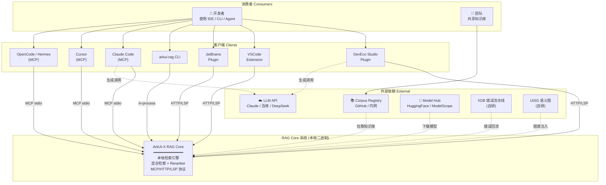
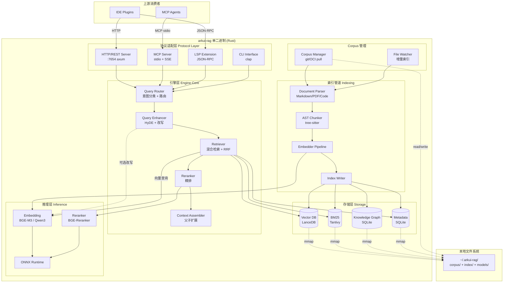
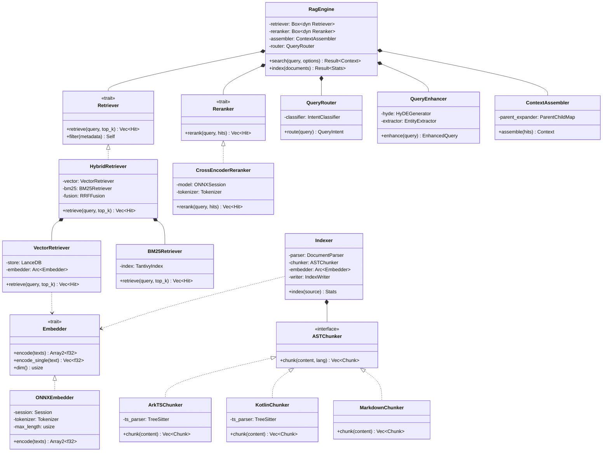
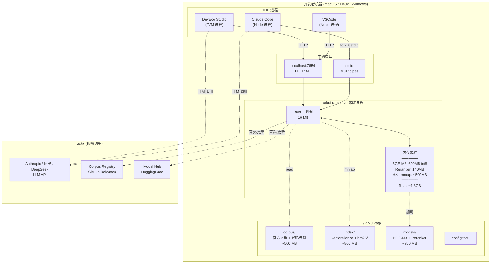
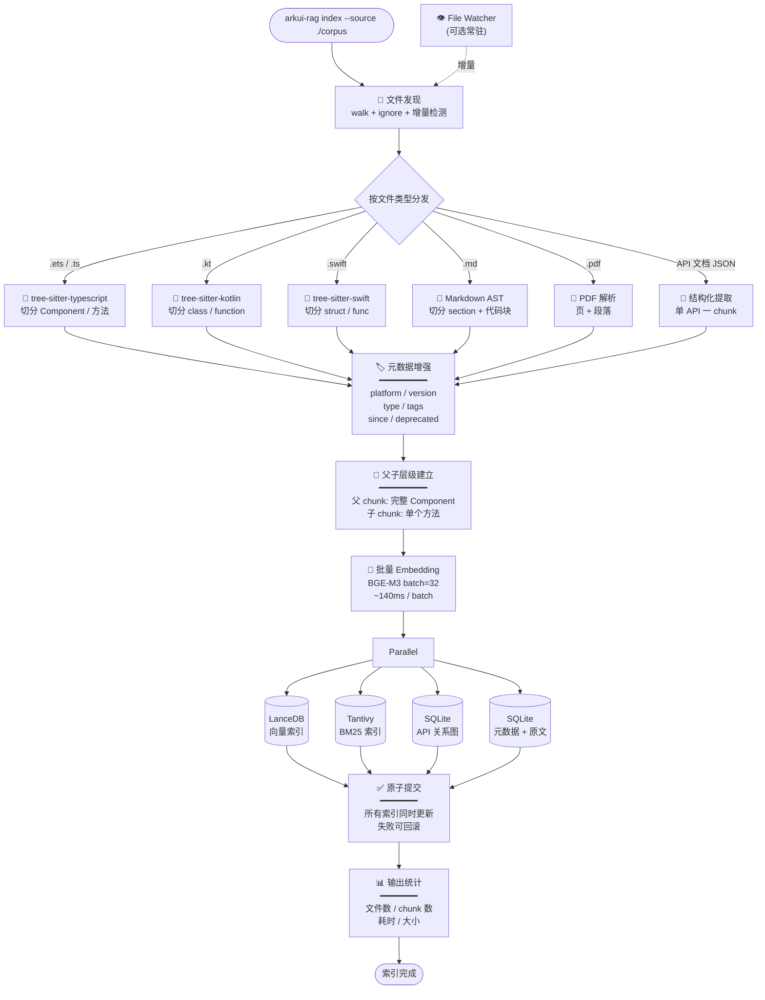
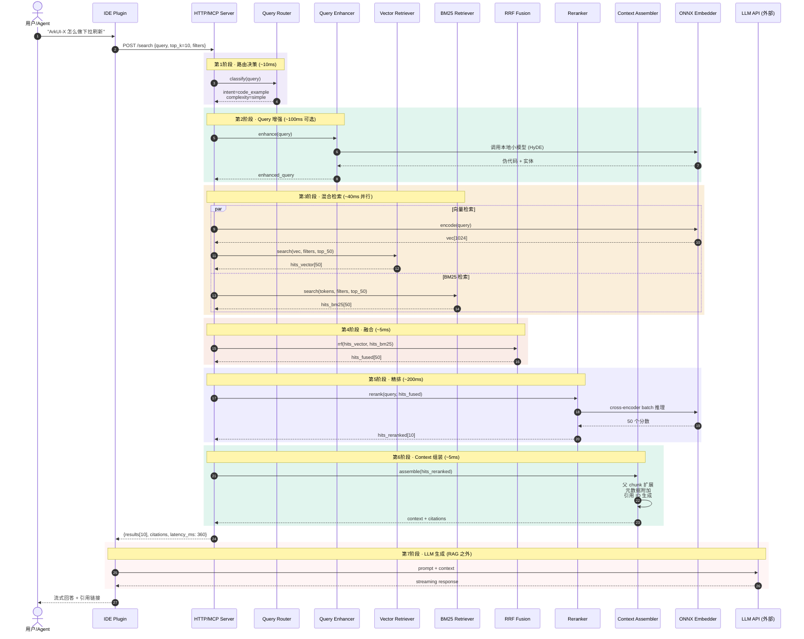
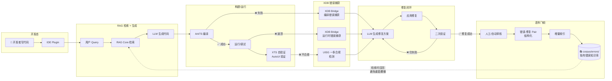
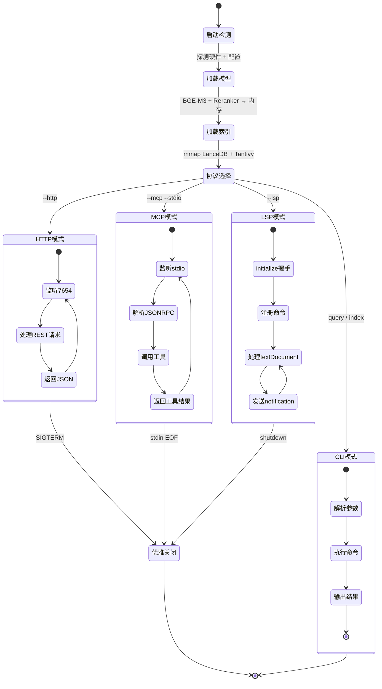
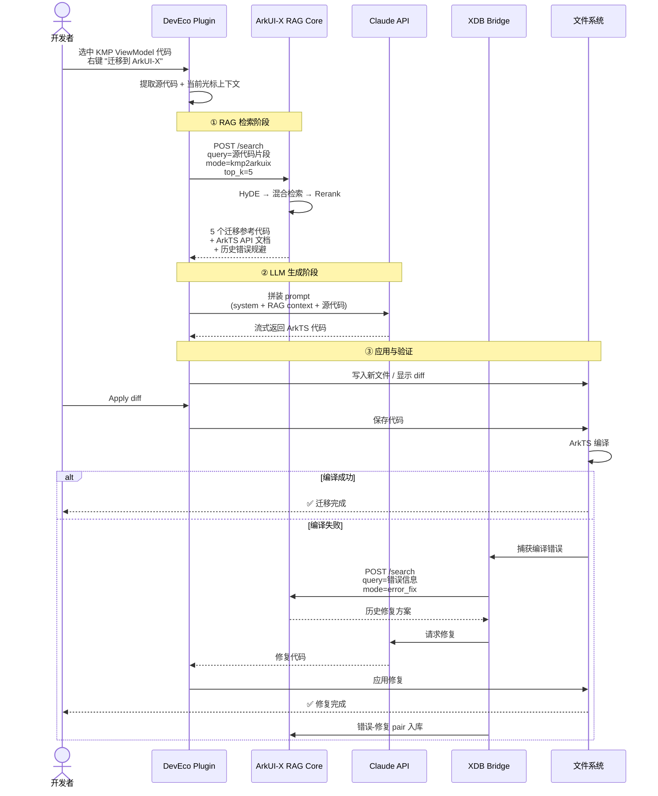

# RAG4ArkUI 完整技术方案

> 面向 OpenHarmony / ArkUI-X 的本地化 RAG 代码生成与迁移系统
>
> 整合自系列技术对话，覆盖：RAG 理论 → 业界实践 → 系统架构 → 落地方案 → UML 全景

---

## 目录

- [一、RAG 理论体系](#一rag-理论体系)
- [二、ArkUI-X 代码 RAG 场景分析](#二arkui-x-代码-rag-场景分析)
- [三、多模型 RAG 系统初步设计](#三多模型-rag-系统初步设计)
- [四、本地 RAG 系统跨形态落地方案](#四本地-rag-系统跨形态落地方案)
- [五、RAG Core 的本质与二进制形态](#五rag-core-的本质与二进制形态)
- [六、内嵌模型推理深度解析](#六内嵌模型推理深度解析)
- [七、ONNX Runtime + Embedding/量化技术详解](#七onnx-runtime--embedding量化技术详解)
- [八、业界 RAG 方案全景与主流实践](#八业界-rag-方案全景与主流实践)
- [九、完整架构图与流程图（UML）](#九完整架构图与流程图uml)
- [附录：决策清单与落地路线图](#附录决策清单与落地路线图)

---

## 一、RAG 理论体系

### 1.1 RAG 演进脉络

RAG 的发展分为三代：

```
Naive RAG → Advanced RAG → Modular RAG
```

最基础范式：
```
用户问题 → [检索] → [增强] → [生成] → 回答
```

### 1.2 三代理论体系详解

#### Naive RAG（基础范式）
- **核心**：Chunk → Embed → Index → Retrieve → Prompt → LLM
- **问题**：召回精度低、chunk 割裂语义、LLM 幻觉无法溯源

#### Advanced RAG（增强检索）

| 技术方向 | 代表方法 | 解决的问题 |
|---|---|---|
| **Query 改写** | HyDE、Step-Back、Multi-Query | 用户意图模糊、单次检索覆盖不足 |
| **混合检索** | BM25 + Dense（RRF 融合） | 单一向量检索语义漂移 |
| **Reranking** | Cross-Encoder、Cohere Rerank | Top-K 召回排序不准 |
| **Chunk 策略** | Sentence Window、Parent-Child、Small-to-Big | 语义割裂 |
| **结构化索引** | Knowledge Graph、HierarchicalIndex | 多跳推理能力弱 |

#### Modular RAG（模块化）

将 RAG 拆解为独立可替换模块。核心模块：
- **Routing**：判断是否需要检索、检索哪个数据源
- **Scheduling**：串行/并行/条件检索
- **Fusion**：多路结果融合
- **Adaptive RAG**：根据 query 复杂度动态选择策略

### 1.3 前沿理论方向

**CRAG（Corrective RAG）**
- 引入检索质量评估器，对召回文档打分，低质量时触发 Web Search 补充

**Self-RAG**
- LLM 自主决定何时检索、如何评估检索结果（Critique Token 机制）
- 论文：*Self-RAG: Learning to Retrieve, Generate, and Critique through Self-Reflection*（2023）

**Graph RAG（微软，2024）**
- 将文档转化为 Knowledge Graph，支持全局摘要级问答
- 核心：Community Detection（Leiden算法）→ Community Summary → 分层检索

**Long-Context RAG**
- 利用 128K+ 上下文窗口，减少 chunk 依赖，但成本控制是关键

### 1.4 产品级工程实践要点

#### 索引层（Indexing）

```
原始文档
  ├── 解析（PDF/HTML/表格/图像）
  ├── Chunking 策略
  │     ├── Fixed-size（简单，但割裂语义）
  │     ├── Recursive Character（LangChain 默认）
  │     ├── Semantic Chunking（按语义边界切）
  │     └── Agentic Chunking（LLM 判断边界）
  ├── 元数据标注（时间、来源、章节、权限）
  └── 多粒度索引（Summary Index + Chunk Index）
```

**产品级关键点**：
- 必须做 **Parent-Child 索引**：检索小 chunk（精准），喂给 LLM 时扩展到父 chunk（上下文完整）
- 元数据过滤优先于向量检索：先用结构化过滤缩小范围，再做语义检索

#### 检索层（Retrieval）

**混合检索是产品标配**：

```
Query
  ├── Dense Retrieval（向量相似度）── 语义理解
  └── Sparse Retrieval（BM25/TF-IDF）── 关键词精确匹配
        ↓
      RRF（Reciprocal Rank Fusion）融合
        ↓
      Reranker（Cross-Encoder）精排
```

**Query 处理流水线**（产品级）：
1. Query 分类（闲聊/RAG/直接回答）
2. Query 改写（HyDE 或 Multi-Query）
3. 实体提取 → 元数据过滤
4. 检索执行
5. Rerank → Top-N

#### 生成层（Generation）

- **引用溯源**：每段回答绑定 source chunk，支持用户点击验证
- **幻觉检测**：生成后用独立模型评估回答是否有 grounding
- **Streaming + 引用内联**：边生成边展示来源

### 1.5 RAG 评估体系

| 维度 | 指标 | 工具 |
|---|---|---|
| 检索质量 | Recall@K、MRR、NDCG | RAGAS、TruLens |
| 生成忠实度 | Faithfulness（有无幻觉） | RAGAS |
| 回答相关性 | Answer Relevancy | RAGAS |
| 端到端 | 人工评估 + LLM-as-Judge | Braintrust |

**RAGAS 四维框架**是目前产品评估标配：
- Context Precision / Context Recall / Faithfulness / Answer Relevancy

### 1.6 总结：产品级 RAG 的核心原则

1. **不要只做向量检索**，混合检索 + Rerank 是基线
2. **Chunking 策略决定上限**，Parent-Child 结构是标配
3. **元数据是被低估的武器**，过滤优于检索
4. **评估先行**，没有 Eval Pipeline 的 RAG 迭代是盲目的
5. **引用溯源是产品可信度的核心**，不是可选项

---

## 二、ArkUI-X 代码 RAG 场景分析

### 2.1 核心挑战

| 挑战 | 具体表现 | 严重程度 |
|---|---|---|
| **语料稀缺** | LLM 几乎没见过 ArkUI-X 代码，HarmonyOS ArkTS 语料也极少 | ★★★★★ |
| **API 时效性** | ArkUI-X API 随版本快速变化，模型易生成已废弃 API | ★★★★☆ |
| **跨平台语义复杂** | 同一功能在 Android Bridge / iOS Bridge / HarmonyOS 实现不同 | ★★★★☆ |
| **ArkTS 语法特殊性** | 装饰器（@Component/@State/@Link）、Builder 模式、并发模型 | ★★★☆☆ |
| **一多适配规则** | 不同断点/设备的 UI 语义差异，模型难以泛化 | ★★★☆☆ |

### 2.2 知识语料体系构建

```
知识语料体系
├── 官方文档语料
│   ├── ArkUI-X 官方 API 文档（结构化解析）
│   ├── HarmonyOS 开发者文档
│   ├── ArkTS 语言规范
│   └── 一多开发规范文档
│
├── 代码示例语料
│   ├── ArkUI-X 官方 Samples 仓库
│   ├── OpenHarmony 开源应用（精筛）
│   ├── 内部高质量代码库（人工审核）
│   └── 迁移成功案例（Android→ArkUI-X）
│
├── 错误知识库（Error Corpus）
│   ├── 编译错误 → 修复 pair
│   ├── 运行时崩溃 → Root Cause pair
│   └── XTS 失败 → 修复 pair（结合 XDB 流水线）
│
└── 规则语料
    ├── ArkUI-X 跨平台兼容性矩阵
    ├── 一多断点规则
    └── 代码风格规范
```

**关键工程动作**：官方 API 文档需要结构化解析，提取成：

```json
{
  "api_name": "router.pushUrl",
  "signature": "pushUrl(options: RouterOptions): Promise<void>",
  "platforms": ["HarmonyOS", "Android", "iOS"],
  "since_version": "ArkUI-X 1.0",
  "deprecated": false,
  "params": [...],
  "example_code": "...",
  "related_apis": ["router.replaceUrl", "router.back"]
}
```

### 2.3 代码感知的 Chunking 策略

```
ArkUI-X 代码切分层级
│
├── 【粒度1】组件级（Component Chunk）← 主要检索单元
│   @Component
│   struct ProductCard { ... }   ← 一个完整组件作为一个 chunk
│
├── 【粒度2】方法级（Method Chunk）← 用于逻辑复用场景
│   build() { ... }
│   aboutToAppear() { ... }
│
├── 【粒度3】文件级 Summary（File Summary Chunk）
│   "该文件实现了商品卡片组件，包含图片懒加载、价格格式化、跨平台点击事件处理"
│   ← 由 LLM 生成摘要，用于粗粒度召回
│
└── 【粒度4】API 文档 Chunk
    一个 API 条目 = 一个 chunk
```

**实现方案**：用 Tree-sitter 解析 ArkTS/TypeScript AST，按 `struct` / `function` / `class` 边界切分。

### 2.4 检索流水线设计

```
用户意图（自然语言 or 残缺代码）
         │
         ▼
┌─────────────────────┐
│   意图分类器        │  → 区分：新建组件 / 修复错误 / API 查询
│                     │         迁移适配 / 一多改造
└─────────────────────┘
         │
         ▼
┌─────────────────────┐
│   Query 增强        │
│  ・提取实体         │  → 识别：组件名、API 名、平台关键词
│  ・HyDE 代码生成    │  → 先让 LLM 生成一段"假代码"，用它做向量检索
│  ・版本元数据注入   │  → 过滤指定 API Level 的文档
└─────────────────────┘
         │
         ▼
┌─────────────────────────────────────────┐
│              混合检索                   │
│  ・向量检索（语义相似代码/文档）        │
│  ・BM25（API 名精确匹配极为重要！）     │
│  ・元数据过滤（platform / version）     │
│  ・图谱检索（API 关联关系）             │
└─────────────────────────────────────────┘
         │
         ▼
┌─────────────────────┐
│   代码专用 Reranker │  → 优先：可运行性、平台兼容性、版本时效性
└─────────────────────┘
         │
         ▼
     Context 组装 → LLM 生成
```

**HyDE 在代码场景特别有效**：用户说"我想实现一个带下拉刷新的列表"，先让 LLM 生成伪代码，用伪代码向量去检索真实代码库，召回质量远高于直接用自然语言检索。

### 2.5 与现有架构衔接

```
UISG（UI Semantic Graph）
     │
     ├── 作为检索的 Query 表示
     │   用户描述的 UI 意图 → 解析为 UISG 节点
     │   → 检索语义相似的 UISG 子图 → 召回对应代码实现
     │
     └── 作为生成结果的验证 schema
         生成代码 → 解析为 UISG → 校验是否符合一多规范

XDB（Cross-Device Debug Bridge）
     │
     └── 错误语料的自动采集管道
         XDB 捕获的编译/运行错误 → 自动入库错误知识库
         → 丰富 Error Corpus → 提升修复类查询的召回质量
```

### 2.6 产品形态选择

| 形态 | 适合场景 | 参考产品 |
|---|---|---|
| **IDE 插件内联补全** | 写代码时实时提示 | GitHub Copilot |
| **Chat 式问答** | 复杂功能咨询、API 查询 | Cursor Chat |
| **迁移助手** | Android/KMP → ArkUI-X 代码转换 | Android Studio Gemini |
| **错误修复建议** | 编译/运行报错时自动给修复方案 | JetBrains AI Assistant |

**建议优先从错误修复场景切入**：语料质量容易保证（错误→修复 pair 结构清晰），用户需求最迫切，效果最容易量化（修复成功率）。

### 2.7 评估指标设计

代码生成 RAG 需要专属评估维度：

| 指标 | 定义 | 测量方式 |
|---|---|---|
| **编译通过率** | 生成代码一次编译成功的比例 | 自动化编译流水线 |
| **跨平台正确率** | 在 Android/iOS/HarmonyOS 均能运行 | XDB 多端自动测试 |
| **API 时效准确率** | 使用的 API 在目标版本存在且未废弃 | API 版本检查器 |
| **Context Precision** | 检索到的代码是否真正被生成使用 | RAGAS |
| **一多合规率** | 生成 UI 是否满足断点适配规范 | AutoUI Validator |

---

## 三、多模型 RAG 系统初步设计

### 3.1 系统目标

支持基于 Claude Code、阿里百炼 Code Plan、DeepSeek 等多种大模型，实现：
- OpenHarmony 代码生成
- KMP → ArkUI-X 代码迁移
- Android → OpenHarmony 代码迁移
- iOS → ArkUI-X 代码迁移

### 3.2 知识库内容设计

针对不同迁移模式，准备专属知识库：

**KMP → ArkUI-X 迁移规则**：
- StateFlow/MutableStateFlow → @State/@Observed
- ViewModel.viewModelScope.launch → async/await Promise
- Compose UI → ArkUI 声明式组件（@Component struct）
- LazyColumn/LazyRow → List/Grid + ForEach
- Navigation Compose → router.pushUrl
- Hilt 依赖注入 → AppStorage 或手动单例
- Kotlin data class → ArkTS interface + class
- sealed class → union type 或 enum

**Android → OpenHarmony 核心映射**：
- Activity/Fragment → @Entry @Component struct Page
- RecyclerView + Adapter → List { ForEach(...) }
- ViewModel + LiveData → @State + @Observed
- Room Database → relationalStore（@ohos.data.relationalStore）
- Retrofit → @ohos/axios 或 http.createHttp()
- Hilt → AppStorage / 手动依赖管理
- Intent/Bundle → router.pushUrl params
- ConstraintLayout → RelativeContainer
- XML 布局 → ArkUI 声明式 build()

**iOS/Swift → ArkUI-X 映射**：
- struct View → @Component struct
- @State → @State
- @Binding → @Link
- @ObservedObject/@EnvironmentObject → @ObjectLink/@Provide/@Consume
- UITableView/UICollectionView → List/Grid
- UINavigationController → router
- Combine Publisher → emitter 或 @Watch
- async/await (Swift) → async/await (ArkTS)
- URLSession → http.createHttp()

### 3.3 多模型适配层

每个 LLM 通过统一接口接入，差异在 endpoint 与 header：

| 模型 | 提供商 | 接入方式 |
|---|---|---|
| Claude Code | Anthropic | `https://api.anthropic.com/v1/messages` |
| 百炼 Code Plan | 阿里 | `https://dashscope.aliyuncs.com/api/v1/services/aigc/text-generation/generation` |
| DeepSeek Coder | DeepSeek | `https://api.deepseek.com/v1/chat/completions` |

---

## 四、本地 RAG 系统跨形态落地方案

### 4.1 整体架构

```
┌─────────────────────────────────────────────────────────────────┐
│  消费层（Consumers）                                            │
│  ┌──────────┐  ┌──────────┐  ┌──────────┐  ┌─────────────────┐ │
│  │ DevEco   │  │ VSCode   │  │ JetBrains│  │ Agents          │ │
│  │ Plugin   │  │ Extension│  │ Plugin   │  │ Claude/OpenCode │ │
│  │          │  │          │  │          │  │ Hermes/Cursor   │ │
│  └────┬─────┘  └────┬─────┘  └────┬─────┘  └────────┬────────┘ │
└───────┼─────────────┼─────────────┼─────────────────┼──────────┘
        │             │             │                 │
        │             │  MCP/HTTP/stdio 协议层        │
        └──────┬──────┴──────┬──────┘                 │
               ▼             ▼                        ▼
┌─────────────────────────────────────────────────────────────────┐
│  接入层 (Adapter Layer)                                         │
│  ┌──────────────┐  ┌──────────────┐  ┌─────────────────────┐  │
│  │ MCP Server   │  │ HTTP/gRPC    │  │ LSP Extension       │  │
│  │ (for Agents) │  │ REST API     │  │ (for IDE inline)    │  │
│  └──────┬───────┘  └──────┬───────┘  └──────────┬──────────┘  │
└─────────┼─────────────────┼─────────────────────┼─────────────┘
          └─────────┬───────┴─────────────────────┘
                    ▼
┌─────────────────────────────────────────────────────────────────┐
│  RAG 内核 (Core Engine) — 纯本地，零依赖云服务                  │
│                                                                 │
│  ┌──────────┐  ┌──────────┐  ┌──────────┐  ┌──────────────┐   │
│  │ Query    │→ │ Hybrid   │→ │ Reranker │→ │ Context      │   │
│  │ Rewriter │  │ Retrieval│  │          │  │ Assembler    │   │
│  └──────────┘  └──────────┘  └──────────┘  └──────────────┘   │
│        ↑              ↑              ↑                          │
│        │              │              │                          │
│  ┌─────┴──────────────┴──────────────┴─────────────────────┐   │
│  │  Storage Layer                                          │   │
│  │  ┌─────────────┐ ┌─────────────┐ ┌─────────────────┐   │   │
│  │  │ Vector DB   │ │ BM25 Index  │ │ Knowledge Graph │   │   │
│  │  │ (Qdrant/    │ │ (Tantivy/   │ │ (SQLite + JSON) │   │   │
│  │  │  LanceDB)   │ │  Meilisearch│ │                 │   │   │
│  │  └─────────────┘ └─────────────┘ └─────────────────┘   │   │
│  └─────────────────────────────────────────────────────────┘   │
│                                                                 │
│  ┌──────────────────────────────────────────────────────────┐  │
│  │  Indexing Pipeline (后台/CLI 触发)                       │  │
│  │  文档源 → Parser → Chunker (AST) → Embedder → Storage   │  │
│  └──────────────────────────────────────────────────────────┘  │
└─────────────────────────────────────────────────────────────────┘
```

### 4.2 八大关键决策

#### 决策 1：内核语言选型

| 选项 | 优势 | 劣势 | 推荐场景 |
|---|---|---|---|
| **Rust** | 性能极佳、单二进制分发、跨平台无依赖 | 开发周期长、生态 ML 弱 | **强烈推荐**（最终方案） |
| Python | ML 生态最全、原型快 | 分发难（依赖地狱）、性能差 | 仅用于离线索引 |
| Go | 分发简单、并发好 | ML 库少、需要 CGO 调 ONNX | 备选 |
| Node/TS | 与 VSCode 原生契合 | 性能瓶颈、内存占用高 | 不推荐 |

**最佳实践**：核心检索服务用 **Rust**（参考 `tantivy`、`qdrant`、`lancedb` 都是 Rust 写的），离线索引/批处理用 **Python**。

#### 决策 2：协议层（最关键）

**MCP（Model Context Protocol）是 2025 年的事实标准**，必须作为一等公民支持。

```
向上暴露三套接口：
├── MCP Server (stdio + SSE)  →  Claude Code / Cursor / OpenCode / Hermes
├── HTTP REST API             →  IDE Plugin / 自研 Agent / curl 调试
└── LSP Custom Commands       →  IDE 内联补全场景
```

**MCP 工具设计**（核心要暴露的 4 个工具）：

```
arkui_search_docs(query, platform_filter, top_k)
  → 检索 API 文档/规范

arkui_search_code(query, mode, top_k)
  → 检索代码示例（mode: example/migration/error_fix）

arkui_migrate_snippet(source_code, from, to)
  → 迁移建议（KMP/Android/iOS → ArkUI-X）

arkui_validate_api(code)
  → API 时效性 & 平台兼容性校验
```

Agent 端配置：
```json
{ "mcpServers": { "arkui-rag": { "command": "arkui-rag", "args": ["serve"] } } }
```

#### 决策 3：嵌入模型本地化

| 模型 | 维度 | 模型大小 | 中文 | 速度 | 推荐度 |
|---|---|---|---|---|---|
| **BGE-M3** | 1024 | 2.2GB | ✓✓ | 中 | ★★★★★ |
| BGE-small-zh | 512 | 100MB | ✓ | 快 | ★★★★ |
| Qwen3-Embedding-0.6B | 1024 | 600MB | ✓✓ | 快 | ★★★★ |
| Jina-v3 | 1024 | 2.3GB | ✓ | 中 | ★★★ |

**部署方案**：用 **ONNX Runtime** 加载（Rust 有 `ort` 绑定），CPU 推理足够。

**Reranker** 用 **BGE-Reranker-v2-m3**（568MB），只对 Top-K=50 → Top-10 做精排。

#### 决策 4：存储层选型

| 方案 | 描述 | 适用 |
|---|---|---|
| **LanceDB**（推荐） | 嵌入式列存 + 向量索引，单文件，Rust 原生 | 个人/团队，零运维 |
| Qdrant 本地模式 | 嵌入式向量库，HTTP+gRPC | 中大型团队 |
| SQLite + sqlite-vec | 极致便携，单文件 | 极致轻量化 |

**关键原则**：**绝不**让用户装 Docker / 跑 Postgres。所有存储要么单文件，要么子目录。安装即可用。

**BM25 索引**：`tantivy`（Rust 版 Lucene），同样嵌入式、单目录。

#### 决策 5：知识库的"两轨"组织

```
~/.arkui-rag/
├── corpus/                  ← 原始文档（可版本化、可分发）
│   ├── official/            ← ArkUI-X 官方文档（git submodule）
│   ├── samples/             ← 官方代码示例
│   ├── migration/           ← 迁移规则库
│   ├── errors/              ← 错误-修复 pair 库（XDB 回流）
│   └── custom/              ← 用户自定义（项目私有）
│
├── index/                   ← 索引产物（可重建，不入 git）
│   ├── vectors.lance/       ← 向量库
│   ├── bm25/                ← BM25 索引
│   └── graph.db             ← API 关系图（SQLite）
│
├── models/                  ← 本地模型缓存
│   ├── bge-m3.onnx
│   └── bge-reranker.onnx
│
└── config.toml              ← 用户配置
```

#### 决策 6：Chunking 与索引策略

```
文档源        切分器                输出 chunk
──────────────────────────────────────────────────
ArkTS 代码 → tree-sitter-typescript → struct/Component 级
Markdown   → markdown AST           → section + 代码块分离
API 文档   → 结构化提取器           → 单 API 一个 chunk
KMP 代码   → tree-sitter-kotlin     → class/function 级
迁移规则   → YAML/JSON              → 规则单元
```

**Parent-Child 索引**：
- **检索粒度**：小 chunk（单方法 / 单 API）→ 召回精准
- **生成粒度**：父 chunk（整个 Component / 整个文档段）→ 上下文完整

**元数据 schema**：
```json
{
  "doc_id": "arkts-router-pushUrl",
  "platforms": ["HarmonyOS", "Android", "iOS"],
  "api_version": "ArkUI-X 1.2",
  "deprecated": false,
  "type": "api_doc | code_example | migration_rule | error_fix",
  "source_framework": "KMP | Android | iOS | null",
  "complexity": "basic | intermediate | advanced",
  "tags": ["routing", "navigation"]
}
```

#### 决策 7：检索流水线性能指标

**必须达到**：
- 单次检索 P99 < 200ms（本地 CPU）
- 索引 10 万 chunks 内存占用 < 1GB
- 冷启动 < 2 秒

#### 决策 8：分发与更新

**两阶段分发**：

```
1. 二进制分发（用 GitHub Releases）
   arkui-rag-darwin-arm64
   arkui-rag-linux-x64
   arkui-rag-windows-x64.exe
   
2. 知识库分发（用 OCI Artifact 或 Git）
   docker pull arkui-rag/corpus:v1.2.0
   # 或
   arkui-rag corpus pull official@v1.2.0
```

### 4.3 IDE Plugin 落地拆解

#### DevEco Studio（最重要的目标平台）

```
Plugin 层职责（薄）：
├── 注册命令（"ArkUI: 迁移此文件"）
├── Inline Completion Provider
├── Tool Window（侧边栏聊天 UI）
├── Diagnostics（API 时效性检查）
└── 通过 HTTP 调用本地 arkui-rag 服务

启动逻辑：
1. Plugin 启动时检测 arkui-rag 二进制
2. 未安装：引导用户一键安装
3. 启动后台服务：localhost:7654
4. 健康检查 + 自动重启
```

**关键 UX 设计**：
- 选中代码 → 右键 → "迁移到 ArkUI-X" → 流式预览 diff
- 编辑器内出现废弃 API → 实时下划线 + 快速修复
- Cmd+K 唤起命令面板 → 自然语言查询

### 4.4 Agent 集成（MCP 一统天下）

**核心思路**：写一次 MCP Server，所有 Agent 通吃。

```bash
arkui-rag serve --mcp --stdio   # for Claude Code, Cursor
arkui-rag serve --mcp --sse     # for Web Agents
arkui-rag serve --http          # for IDE Plugin
```

**Claude Code 接入**：
```json
// ~/.claude/mcp.json
{
  "mcpServers": {
    "arkui-rag": {
      "command": "arkui-rag",
      "args": ["serve", "--mcp", "--stdio"]
    }
  }
}
```

### 4.5 关键风险与对策

| 风险 | 对策 |
|---|---|
| ArkUI-X API 快速迭代，文档过时 | corpus 加 `api_version` 元数据，检索时强制过滤 |
| 用户企业代码不能上云 | 全本地推理，零网络出口 |
| 索引体积过大（>5GB）| 分级 corpus，按需下载（core/extended/samples）|
| IDE 插件卡顿 | 检索严格异步、超时 300ms 兜底 |
| 不同 IDE 重复开发 | 协议层统一，UI 层各自适配 |
| Embedding 模型升级导致索引失效 | 索引版本号 + 增量重建工具 |
| MCP 协议变化 | 抽象一层 Protocol Adapter |

### 4.6 推荐技术栈

```
核心服务（Rust）
├── axum            HTTP server
├── mcp-rs          MCP protocol
├── lancedb         向量库
├── tantivy         BM25
├── ort             ONNX 推理
├── tree-sitter     AST 切分
└── tokio           异步运行时

离线索引（Python）
├── transformers    模型导出 ONNX
├── unstructured    复杂文档解析
└── tree-sitter-py  AST 切分

IDE 插件
├── DevEco/IntelliJ → Kotlin
├── VSCode          → TypeScript
└── 共享一份 OpenAPI Schema 生成 client

Agent 接入
└── MCP Server (内置在 Rust 二进制中)
```

---

## 五、RAG Core 的本质与二进制形态

### 5.1 RAG Core 的职责边界

**Core 是什么**：一个纯本地的检索引擎，输入 query 输出相关文档，**不做** LLM 生成、不做 UI、不做对话。

```
┌─────────────────────────────────────────────────┐
│  RAG Core 内部结构                              │
│                                                 │
│  1. 索引管道（Indexing）                        │
│     文档输入 → 切分 → 嵌入 → 存储              │
│                                                 │
│  2. 检索引擎（Retrieval）                       │
│     Query → 改写 → 混合检索 → Rerank → Context │
│                                                 │
│  3. 存储管理（Storage）                         │
│     Vector DB + BM25 + Metadata 统一管理        │
│                                                 │
│  4. 模型推理（Inference）                       │
│     Embedding 模型 + Reranker 本地 ONNX 推理   │
│                                                 │
│  5. 协议适配（Protocol）                        │
│     HTTP / MCP / CLI 三种暴露方式              │
│                                                 │
│  6. Corpus 管理（Lifecycle）                    │
│     文档增删改 / 版本管理 / 增量更新           │
└─────────────────────────────────────────────────┘
```

**Core 不做的事**：
```
✗ 不调用 LLM 生成代码        ← 这是 Agent/IDE 的事
✗ 不渲染 UI                  ← 这是 IDE Plugin 的事
✗ 不做对话管理               ← 这是 Agent Framework 的事
✗ 不做 Prompt 工程            ← 这是上层应用的事
✗ 不依赖网络（除了下载模型/corpus）
```

### 5.2 核心 API

```
1. index(documents)
   输入: [{ content, metadata }]
   输出: 索引完成的统计
   作用: 把文档加入知识库

2. search(query, options)
   输入: { query, top_k, filters }
   输出: [{ content, score, metadata, source }]
   作用: 检索相关文档（核心 API）

3. update_corpus(source)
   输入: corpus 源（git/本地路径/OCI）
   输出: 更新报告
   作用: 拉取或更新知识库

4. health()
   输出: 状态信息
   作用: 检查服务健康度
```

### 5.3 为什么必须是二进制形态

**七个核心理由**：

#### 理由 1：单文件分发，零心智负担

```
【二进制方案】
curl -sSL install.arkui-rag.dev | sh
→ 完成

【Python 方案】
装 Python → 装 CUDA → 装 50 个依赖 → 解决冲突 → 调环境变量
```

#### 理由 2：IDE 插件能直接拉起进程

```kotlin
val process = ProcessBuilder("arkui-rag", "serve", "--port", "7654")
    .redirectErrorStream(true)
    .start()
// 3 行代码完成
```

#### 理由 3：MCP Agent 也需要二进制

```json
{
  "mcpServers": {
    "arkui-rag": {
      "command": "arkui-rag",        ← 必须是可执行文件
      "args": ["serve", "--mcp"]
    }
  }
}
```

#### 理由 4：性能与启动速度

| 维度 | Rust 二进制 | Python |
|---|---|---|
| 冷启动 | < 100ms | 1-3 秒 |
| 检索 P99 | < 100ms | 200-500ms |
| 内存占用（idle） | ~50MB | ~500MB |
| 内存占用（载模型） | ~2GB | ~3-4GB |

#### 理由 5：跨平台一致性

```
arkui-rag-darwin-x64        (8MB)
arkui-rag-darwin-arm64      (8MB)
arkui-rag-linux-x64         (10MB)
arkui-rag-linux-arm64       (10MB)
arkui-rag-windows-x64.exe   (12MB)
```

#### 理由 6：内嵌模型推理

二进制静态链接 ONNX Runtime，模型加载到内存常驻：
- 数据不出本地（企业合规友好）
- 零网络延迟
- 离线可用

#### 理由 7：版本管理与升级

```bash
arkui-rag --version
arkui-rag self-update
arkui-rag corpus update
```

### 5.4 业界对比

| 项目 | 形态 | 启示 |
|---|---|---|
| **Qdrant** | Rust 二进制 | 向量库的事实标准 |
| **Meilisearch** | Rust 二进制 | 全文检索引擎 |
| **tantivy** | Rust 库 | 嵌入式 BM25 |
| **LanceDB** | Rust 库 + 多语言绑定 | 嵌入式向量库 |
| **ripgrep** | Rust 二进制 | 代码检索神器 |
| **Claude Code** | Node 二进制 | Anthropic CLI |
| **Ollama** | Go 二进制 | 本地 LLM 推理 |

**所有面向开发者的成功本地工具都是二进制**。

---

## 六、内嵌模型推理深度解析

### 6.1 RAG 内嵌模型 vs LLM 的区别

| 维度 | RAG Core 内嵌模型 | LLM (Claude/GPT) |
|---|---|---|
| 模型规模 | 100MB~2GB | 几十~几百 GB |
| 运行位置 | 本地 CPU 进程内 | 云端 GPU 集群 |
| 调用方式 | 函数调用（内存里） | HTTP API |
| 单次延迟 | 5~50ms | 500~3000ms |
| 调用频次 | 每次检索 N 次 | 每次对话 1 次 |
| 用途 | 把文本变成向量、给文档打分 | 理解 + 生成 |

### 6.2 三个内嵌模型的角色

#### 模型 1：Embedding 模型（必需）

**作用**：把任意文本（query、文档片段）转换成 1024 维向量。

```
输入: "如何实现下拉刷新"
       ↓
   ┌────────────────┐
   │  BGE-M3 模型   │
   │  (2.2GB)       │
   └────────────────┘
       ↓
输出: [0.12, -0.34, 0.78, ..., 0.05]  (1024 个数字)
```

**用在两个时刻**：
1. 索引时（离线）：每个文档 chunk → Embedding → 向量库
2. 检索时（在线，每次都跑）：用户 query → Embedding → 拿向量去向量库找邻居

#### 模型 2：Reranker 模型（强烈推荐）

**作用**：给"query + 文档"这对组合打一个相关性分数。

**关键差异**：

```
Embedding（双塔模型）：
   query  ──→ 向量A ┐
                    ├──→ 算余弦相似度
   document ─→ 向量B ┘
   优点: 文档向量可预先算好，检索快
   缺点: 精度有限

Reranker（交叉编码器）：
   query + document ──→ 模型 ──→ 直接吐分数
   优点: 精度高得多
   缺点: 每对都要现场推理
```

**两阶段检索的必要性**：
```
假设知识库有 10 万 chunks：

只用 Reranker：
  10 万次推理 × 50ms = 5000 秒   ← 没法用
  
只用 Embedding（向量检索）：
  10 万次余弦计算 < 50ms ✓
  但精度低，前 10 名可能有 3-4 个不相关

最优方案：
  Embedding 召回 Top-50 (50ms)
    → Reranker 精排 50 次（批处理 ~200ms）
  总耗时 < 300ms，精度高
```

**Reranker 让召回精度从 60% 提到 90%**。

#### 模型 3：Query 改写小模型（可选）

```
输入: "刷新列表" (用户口语)
       ↓
   小型 LLM (Qwen3-0.6B)
       ↓
输出: "ArkUI-X List 组件下拉刷新 Refresh 实现"
```

### 6.3 ONNX Runtime 的角色

```
模型文件   类比为   App 应用程序
ONNX Runtime  类比为   操作系统
```

**为什么是 ONNX Runtime**：

| | PyTorch | ONNX Runtime |
|---|---|---|
| 用途 | 训练框架 | 推理专用 |
| 大小 | 几个 G 依赖 | 可静态链接 |
| Python 依赖 | 必须 | 不需要 |
| 性能 | 基线 | 快 2-3 倍 |
| Rust 绑定 | 难 | ort crate |

### 6.4 模型转换流程

```
开源模型（HuggingFace 下载）         转换流程
─────────────────────────────────────────────
bge-m3 (PyTorch 格式)
        ↓
   optimum-cli export onnx
        ↓
bge-m3.onnx  ← 单文件
        ↓
   量化（可选）: fp32 → int8
        ↓
bge-m3-int8.onnx  ← 体积减半，速度提升 2x
```

### 6.5 实际运行时的推理统计

```
单次检索的推理次数：
  Query 改写：     1 次（可选）
  Query Embedding：1 次
  Reranker 精排：  50 次（批处理）
  ───────────────────────
  合计：           ~52 次本地推理
  总耗时：         < 400ms
```

### 6.6 模型存储与加载

```
二进制本身: arkui-rag (10MB)
  内含: ONNX Runtime 静态库 + Rust 代码

模型文件: 单独下载，缓存到本地
  ~/.arkui-rag/models/
    ├── bge-m3.onnx              (2.2GB)
    ├── bge-m3.tokenizer.json    (5MB)
    ├── bge-reranker-v2.onnx     (568MB)
    └── bge-reranker.tokenizer.json (5MB)

首次运行:
  arkui-rag init
  → 检测系统架构（CPU/Apple Silicon/CUDA）
  → 下载对应格式的模型（fp32 / int8 / CoreML）
  → 加载到内存常驻

启动后进程画像：
  arkui-rag serve (常驻进程)
  内存占用: ~2.5GB
    ├── BGE-M3 模型权重: 2.2GB
    ├── Reranker 权重: 568MB
    ├── ONNX Runtime 工作内存: ~200MB
    └── 检索索引（mmap）: 共享内存
```

---

## 七、ONNX Runtime + Embedding/量化技术详解

### 7.1 三个模型在 RAG 流水线中的位置

```
用户 Query
     ↓
┌────────────────────────────────┐
│ 模型 1 · Query 改写器（可选）  │
│ Qwen3-0.6B · ~100ms            │
└────────────────────────────────┘
     ↓
┌────────────────────────────────┐
│ 模型 2 · Embedding 编码器（必需）│
│ BGE-M3 · ~20ms · 每次必跑      │
└────────────────────────────────┘
     ↓
┌────────────────────────────────┐
│ 向量 / BM25 检索（无模型推理） │
│ LanceDB + tantivy · ~30ms      │
└────────────────────────────────┘
     ↓
┌────────────────────────────────┐
│ 模型 3 · Reranker 精排器       │
│ BGE-Reranker-v2 · ~200ms (50 次)│
└────────────────────────────────┘
     ↓
返回 Top-10 Context
     ↓
外部 LLM 生成（不在 Core 内）
```

### 7.2 ONNX Runtime 加载 BGE-M3 的 Rust 代码

#### Cargo.toml

```toml
[package]
name = "arkui-rag-embedding"
version = "0.1.0"
edition = "2021"

[dependencies]
ort = { version = "2.0.0-rc.4", features = ["load-dynamic", "ndarray"] }
tokenizers = "0.20"
ndarray = "0.16"
anyhow = "1.0"
tokio = { version = "1", features = ["full"] }
```

#### embedding.rs

```rust
use anyhow::{Context, Result};
use ndarray::{Array2, Axis};
use ort::{
    execution_providers::{CPUExecutionProvider, CoreMLExecutionProvider, CUDAExecutionProvider},
    session::{Session, builder::GraphOptimizationLevel},
    value::Tensor,
};
use std::path::Path;
use std::sync::Arc;
use tokenizers::Tokenizer;

/// 一个加载好的 Embedding 模型实例，常驻内存
pub struct EmbeddingModel {
    session: Session,
    tokenizer: Tokenizer,
    max_length: usize,
    embed_dim: usize,
}

impl EmbeddingModel {
    /// 加载 BGE-M3 ONNX 模型与对应 tokenizer
    pub fn load(model_dir: &Path) -> Result<Self> {
        // 1. 初始化 ONNX Runtime
        ort::init()
            .with_name("arkui-rag")
            .with_execution_providers([
                CoreMLExecutionProvider::default().build(),
                CUDAExecutionProvider::default().build(),
                CPUExecutionProvider::default().with_arena_allocator(true).build(),
            ])
            .commit()?;

        // 2. 加载 ONNX 模型
        let model_path = model_dir.join("model.onnx");
        let session = Session::builder()?
            .with_optimization_level(GraphOptimizationLevel::Level3)?
            .with_intra_threads(4)?
            .commit_from_file(&model_path)?;

        // 3. 加载 tokenizer
        let tokenizer = Tokenizer::from_file(model_dir.join("tokenizer.json"))
            .map_err(|e| anyhow::anyhow!("加载 tokenizer 失败: {}", e))?;

        Ok(Self {
            session,
            tokenizer,
            max_length: 512,
            embed_dim: 1024,
        })
    }

    /// 对一批文本做 Embedding
    pub fn encode(&self, texts: &[&str]) -> Result<Array2<f32>> {
        let batch_size = texts.len();
        let encodings = self.tokenizer.encode_batch(texts.to_vec(), true)
            .map_err(|e| anyhow::anyhow!("tokenize 失败: {}", e))?;

        let mut input_ids = Array2::<i64>::zeros((batch_size, self.max_length));
        let mut attention_mask = Array2::<i64>::zeros((batch_size, self.max_length));

        for (i, enc) in encodings.iter().enumerate() {
            let ids = enc.get_ids();
            let mask = enc.get_attention_mask();
            let len = ids.len().min(self.max_length);
            for j in 0..len {
                input_ids[[i, j]] = ids[j] as i64;
                attention_mask[[i, j]] = mask[j] as i64;
            }
        }

        let outputs = self.session.run(ort::inputs![
            "input_ids" => Tensor::from_array(input_ids)?,
            "attention_mask" => Tensor::from_array(attention_mask.clone())?,
        ]?)?;

        let hidden_states = outputs[0].try_extract_tensor::<f32>()?;
        let pooled = self.mean_pooling(&hidden_states.view(), &attention_mask)?;
        Ok(Self::l2_normalize(pooled))
    }

    fn mean_pooling(&self, hidden: &ndarray::ArrayViewD<f32>, mask: &Array2<i64>) -> Result<Array2<f32>> {
        let (batch_size, seq_len, dim) = (hidden.shape()[0], hidden.shape()[1], hidden.shape()[2]);
        let mut result = Array2::<f32>::zeros((batch_size, dim));
        for b in 0..batch_size {
            let mut sum_mask = 0.0_f32;
            for s in 0..seq_len {
                let m = mask[[b, s]] as f32;
                if m > 0.0 {
                    sum_mask += m;
                    for d in 0..dim {
                        result[[b, d]] += hidden[[b, s, d]] * m;
                    }
                }
            }
            let denom = sum_mask.max(1e-9);
            for d in 0..dim {
                result[[b, d]] /= denom;
            }
        }
        Ok(result)
    }

    fn l2_normalize(mut arr: Array2<f32>) -> Array2<f32> {
        for mut row in arr.axis_iter_mut(Axis(0)) {
            let norm = row.iter().map(|x| x * x).sum::<f32>().sqrt().max(1e-9);
            row.mapv_inplace(|x| x / norm);
        }
        arr
    }
}

pub type SharedEmbedding = Arc<EmbeddingModel>;
```

### 7.3 主流 Embedding 模型对比

| 模型 | 维度 | 模型大小 | 中文 | 代码 | 长文本 | MTEB-zh |
|---|---|---|---|---|---|---|
| **BGE-M3** | 1024 | 2.27 GB | ★★★★★ | ★★★★ | 8192 | 67.5 |
| **Qwen3-Embedding-0.6B** | 1024 | 1.19 GB | ★★★★★ | ★★★★★ | 32K | 70.2 |
| **bge-large-zh-v1.5** | 1024 | 1.3 GB | ★★★★ | ★★★ | 512 | 64.5 |
| **Jina-embeddings-v3** | 1024 | 2.3 GB | ★★★ | ★★★★ | 8192 | 60.1 |
| **conan-embedding-v1** | 1792 | 1.4 GB | ★★★★★ | ★★★ | 512 | 72.0 |

**针对 ArkUI-X 场景的双模型策略**：

```
默认配置（轻量）：
  Qwen3-Embedding-0.6B (int8 量化后 ~600MB)
  ├── 中英文都强
  ├── 代码场景最适合
  └── 体积小，IDE 内嵌不卡

高质量配置（可选）：
  BGE-M3 (int8 量化后 ~1.1GB)
  ├── 支持稠密+稀疏+ColBERT 多种检索
  └── 8K 长文本对整文件 chunk 友好
```

### 7.4 量化技术：把模型缩小 4 倍

#### 量化原理

```
原始权重 fp32（32 位浮点）
  BGE-M3 → 5.6 亿 × 4 字节 = 2.24 GB

量化后 int8（8 位整数）
  BGE-M3 → 5.6 亿 × 1 字节 = 560 MB

量化后 int4（4 位整数）
  BGE-M3 → 5.6 亿 × 0.5 字节 = 280 MB
```

#### 三种主流量化方案

| 方案 | 比特数 | 缩小比 | 精度损失 | 推理加速 | 适用 |
|---|---|---|---|---|---|
| **动态量化** | int8 | 4x | <1% | 1.5-2x | Embedding 模型首选 |
| **静态量化** | int8 | 4x | <2% | 2-3x | 需要校准数据集 |
| **GPTQ** | int4 | 8x | 1-3% | 2-4x | LLM 用 |
| **AWQ** | int4 | 8x | 1-2% | 3-4x | 同上 |
| **fp16** | 16 位 | 2x | <0.1% | 1.5x | GPU 推理友好 |

#### 量化效果实测

| 模型 | 大小 | 加载内存 | 单条推理 | 批量 32 条 | Recall@10 |
|---|---|---|---|---|---|
| BGE-M3 fp32 | 2270 MB | 2.4 GB | 45 ms | 280 ms | 0.892 |
| BGE-M3 fp16 | 1135 MB | 1.3 GB | 32 ms | 200 ms | 0.891 |
| **BGE-M3 int8 动态** | **568 MB** | **750 MB** | **22 ms** | **140 ms** | **0.886** |
| BGE-M3 int8 静态 | 568 MB | 700 MB | 18 ms | 110 ms | 0.881 |

**核心结论**：动态 int8 是最佳平衡点。

#### 量化命令

```bash
# 步骤 1：导出 ONNX
optimum-cli export onnx \
    --model BAAI/bge-m3 \
    --task feature-extraction \
    --opset 17 \
    ./bge-m3-onnx

# 步骤 2：动态量化
optimum-cli onnxruntime quantize \
    --onnx_model ./bge-m3-onnx \
    --avx512_vnni \
    -o ./bge-m3-onnx-int8
```

### 7.5 硬件适配策略

```
启动时探测，自动选最优：

if apple_silicon:
    load("model_fp16_coreml.onnx")     # 1.1GB，CoreML 加速
elif x86_avx512:
    load("model_int8_static.onnx")     # 560MB，最快
elif nvidia_gpu:
    load("model_fp16_cuda.onnx")       # 1.1GB，GPU 加速
else:
    load("model_int8_dynamic.onnx")    # 560MB，兜底
```

### 7.6 完整启动序列

```
arkui-rag serve 启动序列：
┌──────────────────────────────────────────────────────┐
│ T+0.0s   进程启动                                    │
│ T+0.1s   探测硬件 → Apple M2 Pro                     │
│ T+0.2s   加载 BGE-M3 fp16-coreml (1.1GB → 内存)      │
│ T+1.8s   加载 BGE-Reranker int8 (140MB → 内存)       │
│ T+2.0s   预热推理（跑 1 次空 query 让 JIT warm up）  │
│ T+2.3s   监听 HTTP :7654 / MCP stdio                 │
│ T+2.3s   ✓ Ready                                     │
└──────────────────────────────────────────────────────┘

启动后内存占用：~1.5 GB（含模型 + 运行时）

一次检索的时间分解：
┌──────────────────────────────────────────────────────┐
│ Query: "ArkUI-X 怎么做下拉刷新"                      │
│                                                      │
│ Step 1: Tokenize           0.5 ms                    │
│ Step 2: Embedding (CoreML) 8 ms                      │
│ Step 3: 向量检索 (LanceDB) 25 ms                     │
│ Step 4: BM25 (tantivy)     12 ms (并行)              │
│ Step 5: RRF 融合           1 ms                      │
│ Step 6: Reranker batch 50  180 ms                    │
│ Step 7: Parent 扩展        5 ms                      │
│ ───────────────────────────────────                  │
│ Total:                     ~230 ms                   │
└──────────────────────────────────────────────────────┘
```

---

## 八、业界 RAG 方案全景与主流实践

### 8.1 主流 RAG 范式

#### 范式 1：Hybrid Retrieval（事实标准）

业界数据：
- **Perplexity**：在 Vespa.ai 上每天处理 2 亿次混合检索查询
- **Glean**：词法 + 向量 + 知识图谱三层结合
- **Notion**：Turbopuffer 向量搜索 + ElasticSearch 关键词索引

**结论**：生产规模上，没有任何单一检索模式能覆盖完整 query 分布。

#### 范式 2：Self-RAG（自反思）

输出反思 Token（`[Retrieve]`/`[Relevant]`/`[Supported]`），自己决定是否要检索。

**实测效果**：2025 年 MDPI Electronics 研究显示，Self-RAG 是 12 种 RAG 变体里幻觉率最低的（5.8% vs 标准 12-14%）。

#### 范式 3：Corrective RAG (CRAG)

在检索和生成之间加入质量评估器：
- Correct → 直接用
- Ambiguous → 改写后重检索
- Incorrect → 触发 Web Search 兜底

#### 范式 4：GraphRAG（微软首推）

**核心创新**：把文档转化为知识图谱，支持全局摘要级问答。

**LazyGraphRAG**：微软 2024-2025 升级版，把索引成本降低 700+ 倍，已集成到 Microsoft Discovery 和 Azure Local。

#### 范式 5：Agentic RAG

**关键差异**：
- 传统 RAG：检索一次就把上下文给模型
- Agentic RAG：迭代、自适应——Agent 识别信息缺口、调用工具、循环直到任务解决

**延迟代价**：
- Vanilla RAG：1-2 秒
- Agentic RAG（3-4 轮）：8-12 秒

#### 范式 6：Adaptive RAG（路由层）

小型 T5-large 分类器预测查询难度：无需检索 / 单步检索 / 多步检索。

**实测**：典型产品 60-80% 是查找类（走快速路径），20-40% 是推理类（走 Agent 循环）。Adaptive 路由能降低平均成本 30-50%。

#### 范式 7：Late Interaction（ColBERT 系）

保留 token 级别向量交互，精度比 Dense 高，但存储和计算成本翻几倍。代表：RAGatouille。

#### 范式 8：Long-Context RAG / TreeRAG

利用 128K+ 上下文窗口减少 chunk 依赖，叠加树形结构索引。
- TreeRAG：解决物理切分的局部语义断裂
- GraphRAG：基于实体关系网络，Personalized PageRank 跨文档关联

### 8.2 开源框架全景对比

| 框架 | 定位 | GitHub Stars | 最适合场景 | 短板 |
|---|---|---|---|---|
| **LangChain / LangGraph** | 全能型瑞士军刀 | 95k+ | Agent + 工具调用 + 复杂工作流 | 抽象层重，调试复杂 |
| **LlamaIndex** | 索引/检索专家 | 35k+ | 文档密集 RAG、复杂数据接入 | Agent 能力相对弱 |
| **Haystack** (deepset) | 企业级生产 | 17k+ | 受监管行业、严格评估 | 学习曲线陡 |
| **RAGFlow** | 深度文档理解 | 30k+ | 复杂文档解析（合同/财报） | 视觉化工作流偏重 |
| **Dify** | 低代码可视化平台 | 60k+ | 业务团队快速搭建 RAG App | 灵活性受限 |
| **LightRAG** | 轻量级（港大） | 12k+ | 资源受限、快速原型 | 大规模能力弱 |
| **DSPy** | 优化器驱动 | 18k+ | 程序化 RAG | 心智模型独特 |
| **R2R / SciPhi** | 一体化生产 | 5k+ | 端到端托管 | 国内访问不便 |

**业界共识**：
- LangGraph 在 Agentic 编排和长任务工作流上领先
- Haystack 在受监管场景的准确性和评估上占优
- LangChain 在快速实验上无敌
- 最强组合：LlamaIndex（检索）+ LangGraph（编排）

### 8.3 顶级商业产品的 RAG 架构

#### Perplexity：实时搜索 RAG 标杆

**架构核心**：使用 Vespa AI，把向量搜索、词法搜索、结构化过滤和机器学习排序整合到单一引擎。

**规模**：每天 2 亿次查询。

**产品差异点**：每条回答必带引用、流式生成 + 增量引用。

#### Sourcegraph Cody：代码 RAG 标杆

**架构关键决策**：结合 Sourcegraph 的代码搜索引擎（关键词搜索、SCIP 代码图、语义搜索）和 RAG。支持 100 万 token 上下文，最多 10 个远程仓库。

**有趣的反向决策**：Cody Enterprise 正式发布后暂时放弃了 embeddings——他们发现对代码场景，**纯关键词 + 代码图搜索** 比向量检索效果更好（**对 ArkUI-X 项目极有启发**）。

**企业部署**：完全部署在自己的基础设施，源代码永远不会发送到第三方服务。

#### Cursor：动态上下文加载

Cursor 是 AI 原生的 VS Code 分支，使用动态上下文加载，不预索引。

**核心差异**：
- Cursor：零设置时间，但云端部署、VS Code 独占
- Cody：RAG 预索引，支持自托管、跨仓库

#### Microsoft 365 Copilot：企业级 Graph RAG

三步流程：
1. 检索——通过 Microsoft Graph 拉取上下文
2. 锚定——把企业内容嵌入用户 prompt
3. 生成——Azure OpenAI 处理

**关键安全设计**：Copilot 只能检索用户已经有权访问的内容——零越界。

#### Glean：企业搜索之王

词法 + 向量 + 知识图谱三层结合。

**业务地位**：OpenAI 在最新 66 亿美元融资中告知投资者不能同时投资 Glean。

#### Notion AI：双索引架构

Turbopuffer 向量搜索 + ElasticSearch 关键词索引。

### 8.4 代码 RAG 三大流派

```
1. 静态上下文流派（AGENTS.md / .cursorrules）
   - 项目根目录放规则文件，全量喂给 LLM
   - 适合小项目、规则稳定
   - 局限：上下文窗口爆炸

2. RAG 检索流派（Cody / Continue.dev）
   - 预索引 + 语义检索
   - 适合大型代码库、跨仓库
   - 局限：索引维护成本

3. 持续代码智能平台（CoreStory / Augment）
   - 持久化代码图谱 + 依赖分析
   - 适合企业级 monorepo
   - 局限：基础设施重
```

### 8.5 2025 业界五条共识

```
共识 1：混合检索是默认配置，不是可选项
   Perplexity / Glean / Notion / Cody 全部采用
   单一向量检索已经被淘汰

共识 2：Reranker 是产品级 RAG 的分水岭
   不上 Reranker 的精度上限在 65%
   上 Reranker 能到 85%+

共识 3：引用溯源是产品可信度的核心
   Perplexity 用此打天下
   企业场景没有引用 = 没有信任

共识 4：评估先行，Eval-Driven Development
   先建测试集再迭代
   每次改动跑 RAGAS

共识 5：Agentic 是趋势，但 Adaptive 路由是产品策略
   不是所有 query 都需要 Agent 循环
   80% query 走快速路径
```

### 8.6 给 ArkUI-X 项目的方案选型

#### 架构定位

**学 Sourcegraph Cody，不要学 Perplexity**

理由：
1. 代码场景：精确匹配 > 语义模糊匹配（Cody 路线）
2. 私有部署：企业代码不出本地（Cody Enterprise 模型）
3. IDE 集成：服务端化、协议化（MCP）

#### 技术栈选型

```
检索引擎层：Vespa 太重，选 LanceDB + Tantivy 嵌入式
框架层：不要选 LangChain（太重），自研轻量 Rust 内核
评估层：必装 RAGAS + 代码专用指标（编译通过率）
范式：从 Advanced RAG 起步，逐步引入 CRAG / Agentic
```

#### 范式落地节奏

```
阶段一（MVP）：Advanced RAG
  Hybrid Retrieval + Reranker + 引用溯源
  目标：能用、能跑

阶段二（产品化）：+ Adaptive 路由
  Query 分类器路由简单/复杂查询
  目标：延迟可控

阶段三（差异化）：+ 错误修复 Agentic 循环
  接入 XDB 错误数据 + 自我纠错
  目标：飞轮形成

阶段四（高阶）：+ Code GraphRAG
  ArkTS 代码图谱（调用关系、组件依赖）
  目标：跨文件多跳推理
```

#### 业界对照

| 维度 | 业界主流做法 | 推荐选型 |
|---|---|---|
| 检索方式 | Hybrid（必须） | Hybrid（LanceDB + Tantivy）|
| 切分策略 | 语义/AST 切分 | Tree-sitter AST 切分 |
| Reranker | BGE / Cohere | BGE-Reranker-v2 本地 |
| 范式 | Modular + Adaptive | Advanced 起步，逐步演进 |
| 评估 | RAGAS 四维 | RAGAS + 编译通过率 |
| 部署 | 云为主、企业本地 | **纯本地（差异点）** |
| 协议 | MCP 成事实标准 | MCP + HTTP + LSP |
| 生成 | 流式 + 引用 | 流式 + 引用 + diff |

**核心洞察**：业界 RAG 已经成熟，关键不是"用什么框架"，而是"针对你的领域做什么差异化"。差异化在三处：**ArkUI-X 领域语料 + 本地化部署 + XDB 错误飞轮**——这是任何通用 RAG 框架都给不了的护城河。

---

## 九、完整架构图与流程图（UML）

### 图 1：系统上下文图（C4-Level 1）

**视角**：RAG 系统在整个生态中的位置 —— 谁用它、它依赖什么。



**关键洞察**：
- RAG Core 是中心节点，但**只做检索**，不做生成
- LLM 调用由各 Client 各自完成（关注点分离）
- XDB/UISG 是独有的飞轮输入

### 图 2：容器架构图（C4-Level 2）

**视角**：RAG Core 内部分成哪几个进程/服务/库。



**关键设计**：
- 协议层、引擎层、推理层、存储层**完全解耦**
- 同一个二进制可启动为 HTTP / MCP / LSP / CLI 任一形态
- 文件系统是唯一持久化（无 Docker 无数据库）

### 图 3：核心组件类图（C4-Level 3）

**视角**：Rust trait/struct 设计，关键扩展点。



**关键设计哲学**：
- Retriever/Reranker/Embedder 全部是 **trait**，可热插拔
- 多语言切分器走策略模式（ArkTS / Kotlin / Swift / Markdown）
- Embedder 被 VectorRetriever 和 Indexer 共享

### 图 4：部署拓扑图

**视角**：用户机器上 RAG 系统的物理布局。



**关键事实**：
- 总内存占用 ~1.3GB（含模型）
- 总磁盘占用 ~2GB（首次安装后）
- LLM 调用由 IDE/Agent 各自管理，不经过 RAG 进程
- 离线可用（首次安装后不依赖网络）

### 图 5：索引流程图（Indexing Pipeline）

**视角**：文档怎么从原始格式变成可检索的索引。



**关键步骤**：
1. AST 切分 → 保留语义边界（绝不固定字符数切）
2. 元数据增强 → 后续可精准过滤
3. 父子层级 → 检索小、返回大
4. 并行写入 → 四个索引同时落盘
5. 原子提交 → 失败可回滚

### 图 6：检索流程时序图（Retrieval Sequence）

**视角**：一次完整检索调用，各组件如何协作。



**关键时序约束**：
- RAG Core 端到端：~360ms（含可选 HyDE）
- 不含 HyDE：~260ms
- 第 3 阶段必须并行（向量 + BM25）
- 第 5 阶段是精度关键，但延迟主导

### 图 7：错误飞轮闭环（XDB 集成）

**视角**：最大差异化护城河 —— 错误自动回流的工程闭环。



**飞轮逻辑**：
1. 每次错误被 XDB 捕获 → 自动进入修复循环
2. 修复成功的 case → 结构化为 错误↔修复 pair
3. 增量索引到 corpus/errors/ → 下次类似错误检索时直接命中
4. **越用越聪明**，竞争对手永远没有真实错误数据

### 图 8：协议适配状态图

**视角**：同一个二进制如何切换形态服务不同消费者。



**核心价值**：
- 同一份代码、同一份模型、同一份索引
- 4 种协议无缝切换
- 部署时只需选择一个 flag

### 图 9：端到端业务时序

**视角**：用户视角看一次"迁移 KMP 代码到 ArkUI-X"的完整链路。



### 阅读顺序建议

```
理解全局 → 图 1 (上下文)
深入内部 → 图 2 (容器)
代码层面 → 图 3 (类图)
物理部署 → 图 4 (部署)
索引流程 → 图 5 (索引)
检索流程 → 图 6 (时序)
独家壁垒 → 图 7 (飞轮)
协议形态 → 图 8 (状态)
业务闭环 → 图 9 (端到端)
```

---

## 附录：决策清单与落地路线图

### A.1 关键技术决策一览表

| 决策项 | 选择 | 理由 |
|---|---|---|
| 内核语言 | **Rust** | 性能 + 单二进制 + 跨平台 |
| 协议层 | **MCP + HTTP + LSP** | 一统所有消费者 |
| 向量库 | **LanceDB** | 嵌入式、单文件、Rust 原生 |
| BM25 | **Tantivy** | Rust 版 Lucene |
| Embedding | **Qwen3-0.6B (int8) + BGE-M3 备选** | 体积小、代码强、中英文好 |
| Reranker | **BGE-Reranker-v2-m3 (int8)** | 精度高、本地可推 |
| 推理框架 | **ONNX Runtime** | 静态链接、跨硬件 |
| Chunking | **Tree-sitter AST** | 保留语义边界 |
| 索引格式 | **Parent-Child 双粒度** | 检索小、返回大 |
| 检索策略 | **Hybrid + RRF + Rerank** | 业界标配 |
| 部署形态 | **单二进制 + 文件系统** | 零依赖、零运维 |
| 评估 | **RAGAS + 编译通过率** | 通用 + 领域指标 |

### A.2 落地路线图（6 周 MVP）

```
Week 1-2: 内核 + 索引
  □ Rust 项目骨架（Cargo workspace）
  □ ArkUI-X 官方文档爬取 + 结构化
  □ tree-sitter 切 ArkTS / Kotlin
  □ LanceDB + tantivy 接入
  □ BGE-M3 ONNX 推理打通

Week 3: 检索流水线
  □ 混合检索 + RRF
  □ Reranker 接入
  □ HyDE 改写
  □ 基础评估集（50 个 query）

Week 4: 协议层
  □ HTTP API (OpenAPI 规范)
  □ MCP Server 实现
  □ CLI 工具（arkui-rag query / index / serve）

Week 5: IDE 插件 MVP
  □ DevEco/IntelliJ 插件（聊天 + 右键迁移）
  □ Claude Code 接入验证

Week 6: 打磨发布
  □ 自动安装/更新
  □ corpus 分发管道
  □ 评估报告
  □ 文档站点
```

### A.3 长期演进路径

```
阶段一（0-3 月）：MVP
  Advanced RAG + Hybrid Retrieval + Reranker
  目标：能用、能跑、能装

阶段二（3-6 月）：产品化
  + Adaptive Query Router
  + IDE 三端覆盖（DevEco/VSCode/JetBrains）
  + MCP 接入主流 Agent
  目标：用户量增长、延迟可控

阶段三（6-12 月）：差异化
  + XDB 错误飞轮闭环
  + ArkTS 代码图谱（SCIP-like）
  + 多模型路由（Claude/百炼/DeepSeek）
  目标：飞轮形成、护城河建立

阶段四（12+ 月）：高阶
  + Code GraphRAG（跨文件多跳推理）
  + Self-RAG / CRAG 引入
  + 团队级共享 corpus
  目标：成为 ArkUI-X 生态基础设施
```

### A.4 核心 KPI 目标

| 维度 | 阶段一目标 | 阶段三目标 |
|---|---|---|
| 检索 P99 延迟 | < 500ms | < 200ms |
| Faithfulness | > 0.85 | > 0.92 |
| 编译通过率 | > 70% | > 90% |
| API 时效准确率 | > 90% | > 98% |
| 一多合规率 | > 60% | > 85% |
| 用户引用点击率 | > 20% | > 35% |
| 安装包大小 | < 15MB（不含模型） | < 12MB |
| 内存占用 | < 1.5GB | < 1GB |

---

## 文档元信息

- **文档版本**：v1.0
- **生成日期**：2026-05-26
- **覆盖主题**：RAG 理论 + ArkUI-X 场景 + 系统架构 + 业界实践 + UML 全景
- **目标读者**：架构师 / 资深工程师 / 技术决策者
- **配套资源**：
  - Mermaid 图源：本文图 1-图 9
  - 代码示例：本文第七章（Rust + ONNX Runtime）
  - 评估方法：本文第二章 2.7、附录 A.4

---

> **核心理念**：业界 RAG 已经成熟，关键不是"用什么框架"，而是"针对 ArkUI-X 领域做什么差异化"。
> **三大护城河**：ArkUI-X 领域语料 + 本地化部署 + XDB 错误飞轮 —— 这是任何通用 RAG 框架都给不了的。
