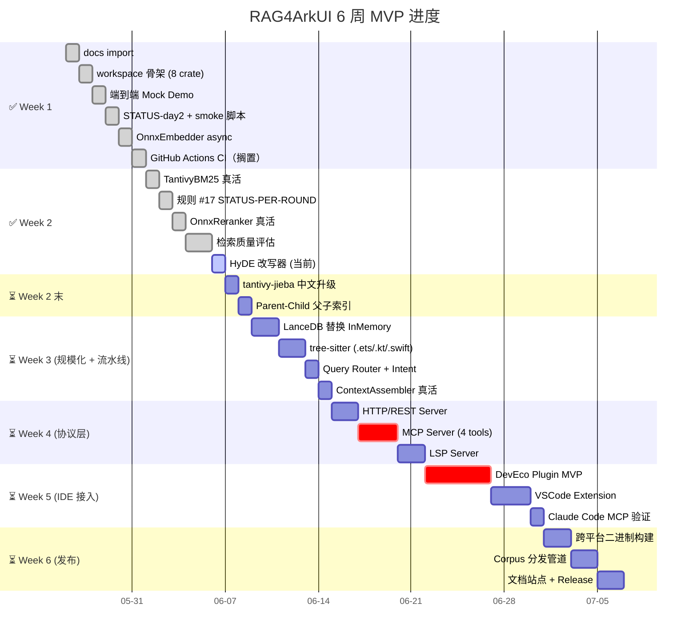

# RAG4ArkUI 路线图 · 全景与进度

> **文档定位**：项目长期维护文档（类似 ADR / README），跨阶段全景视图。
> **维护约定**：每个 Day 完成 commit 后，agent **同步更新本文档的进度标记**（不单独 commit）；新阶段补充进度行；不在本文档归档单次 round 的细节（那些去 STATUS-<slug>.md）。
> **最后更新**：Day 7 完成（2026-05-27 · commit pending · HyDE 改写器）

---

## 📍 当前位置

**Day 7 完成 · HyDE 改写器接入 · QueryEnhancer trait + MockHyde 真活**

- 9 个 Cargo crate
- 37 个测试（默认 features · +1 PassthroughEnhancer + 6 MockHyde）+ onnx/tantivy feature 扩展可达 47 个
- 6 个 STATUS 文档（规则 #17 生效后强制配套）
- 13 个 git commit / 历史 6 个工作 Day

---

## 时间线（Mermaid Gantt）



---

## ✅ 已完成（12 commits）

| Commit | Day | Round | 内容 | STATUS |
|---|---|---|---|---|
| `e375ca4` | 0 | — | docs import | — |
| `95c5f70` | 1 | 1 | Cargo workspace 骨架（7 → 8 crate） | — |
| `69216db` | 2 | 2 | 端到端 Mock Demo + indexer crate | [STATUS-day2](STATUS-day2.md) |
| `1232ccc` | 2.5 | 3 | STATUS-day2.md 阶段快照 | (included) |
| `1b0e04f` | 2.5 | 4 | demo-smoke.sh 脚本 | — |
| `41c00a4` | 3 | 5 | **OnnxEmbedder** async wrapper（BGE-M3 真活） | — |
| `a4410f2` | 3.5 | 6 | GitHub Actions CI（**搁置**） | — |
| `331a912` | 4 | 7 | **TantivyBM25Index** 真活 → Hybrid 名实相符 | [STATUS-day4](STATUS-day4-bm25-tantivy.md)（追溯） |
| `20056b3` | Bootstrap | 8 | **规则 #17** STATUS-PER-ROUND FAIL 级 | [STATUS-bootstrap](STATUS-bootstrap-status-rule.md) |
| `331f180` | 5 | 9 | **OnnxReranker 真活** → Hybrid + Rerank 业界基线 | [STATUS-day5](STATUS-day5-reranker.md) |
| `44d6233` | 6 | 10 | 检索质量评估闭环（arkui-rag-eval crate） | [STATUS-day6](STATUS-day6-eval.md) |
| `0228109` | — | 11 | ROADMAP 全景图归档 | [STATUS-roadmap](STATUS-roadmap-doc.md) |
| _(本 commit)_ | **7 (当前)** | **12** | **HyDE 改写器**（QueryEnhancer trait + MockHyde · CLI --hyde） | [STATUS-day7](STATUS-day7-hyde.md) |

---

## ⏳ 剩余切片（按推荐顺序）

### 🟢 Week 2 末 · 检索质量纵深（2 个切片，Day 7 已完成）

| Day | 切片 | 价值 | 工作量 | 依赖 |
|---|---|---|---|---|
| ~~7~~ | ~~HyDE 改写器~~ | ✅ **Day 7 完成**（MockHyde 真活，远程 LLM 接入留 Week 3） | — | — |
| 8 推荐 | tantivy-jieba 中文分词 | 中文 BM25 精度从 ngram 升级；评估集可量化提升 | 0.5 commit | Day 4 ✓ |
| 11 | Parent-Child 父子索引 | 检索小、返回大（方案 §1.4 标准） | 1 commit | Day 6 ✓ |

### 🟡 Week 3 · 规模化 + 流水线收尾（4 个切片）

| Day | 切片 | 价值 | 工作量 |
|---|---|---|---|
| 9 | **LanceDB** 替换 InMemoryVectorStore | 解锁 chunks > 10k 大规模 corpus | 1-2 commit |
| **10 关键** | **tree-sitter (.ets/.kt/.swift)** | 代码 corpus 真活（非常关键，方案 §2.3） | 2 commit |
| 12 | Query Router + Intent 分类 | 不同 query 走不同流水线（方案 §1.2） | 1 commit |
| 13 | ContextAssembler 真活 | 父 chunk 扩展 + 引用元数据完善 | 1 commit |

### 🟢 Week 4 · 协议层（关键路径，3 个切片）

| Day | 切片 | 价值 | 工作量 |
|---|---|---|---|
| 14 | **HTTP/REST Server (axum)** | 让 IDE 插件能通过 HTTP 接入 | 2-3 commit |
| **15 ⭐ 关键** | **MCP Server (4 tools + stdio/SSE)** | **Claude Code / Cursor 直接接入**，方案核心 | 3-4 commit |
| 16 | LSP Server (tower-lsp) | IDE 内联补全 + diagnostic | 2-3 commit |

### 🟢 Week 5 · IDE 接入（差异化目标，3 个切片）

| Day | 切片 | 价值 | 工作量 |
|---|---|---|---|
| **17 ⭐ 关键** | **DevEco Plugin MVP** | 主战场（方案 §4.3） | 5+ commit · 大工程 |
| 18 | VSCode Extension | 跨编辑器覆盖 | 3+ commit |
| 19 | Claude Code MCP 端到端验证 | 验证 Agent 接入路径 | 1 commit |

### 🟢 Week 6 · 发布（3 个切片）

| Day | 切片 | 价值 | 工作量 |
|---|---|---|---|
| 20 | 跨平台二进制（darwin-x64/arm64 + linux + win） | GitHub Releases 分发 | 1-2 commit |
| 21 | `corpus model-pull` 真实下载 + corpus 分发 | 用户无脑接入 | 2 commit |
| 22 | 文档站点 (mdBook) + release 1.0 | 公开发布 | 1-2 commit |

### 🔮 长期演进 · 阶段 3-4（护城河）

| 切片 | 价值 |
|---|---|
| **XDB 错误飞轮**（自研依赖） | 方案 §1.2 核心差异化护城河 |
| Code GraphRAG（SCIP 代码图谱） | 跨文件多跳推理（方案 §1.4 Phase 4） |
| Self-RAG / CRAG 反思机制 | 幻觉率从 12% 降到 5%（方案 §1.3） |
| UISG 集成（自研依赖） | 一多合规自动验证 |
| 团队级共享 corpus | 多用户支持 |

### 🔧 工程化穿插（meta，非阻塞）

| 切片 | 状态 |
|---|---|
| GitHub Actions CI | 已搁置（Day 3.5 写好等推送目标） |
| STATUS-INDEX.md 时间线索引 | Backlog（用户提到过） |
| `scripts/new-status-doc.sh` 模板生成器 | Backlog |
| STATUS 6 节存在性深度校验 | Backlog（meta feedback 5 列出） |
| `cargo audit` / Codecov / 跨平台 CI 矩阵 | Backlog |

---

## 📊 6 周 MVP 路线图达成度

| 方案章节里程碑 | 状态 | 完成度 |
|---|---|---|
| Week 1: Rust 骨架 + tree-sitter + LanceDB + Tantivy + BGE-M3 | **6/7** ✅ | tree-sitter ⏳ + LanceDB ⏳ |
| Week 2: 混合检索 + Reranker + HyDE + 评估集 | **4/4** ✅ | 全部达成 |
| Week 3: HTTP + MCP + CLI | **1/3** ✅ | HTTP/MCP ⏳ |
| Week 4: IDE 插件 (DevEco/IntelliJ) | **0/2** ⏳ | — |
| Week 5: Claude Code 接入 | **0/1** ⏳ | — |
| Week 6: 自动安装 + corpus 分发 + 文档 + 评估报告 | **1/4** ✅ | 评估报告 ✓ |

**当前完成度估算：~40%**（Week 2 全部达成 · Hybrid + Rerank + Eval + HyDE 完整闭环）。

---

## 🎯 业界基线对照（§8.5）

| 业界共识 | 状态 | 落地 commit |
|---|---|---|
| 共识 1：混合检索是默认配置 | ✅ | Day 4 (`331a912`) |
| **共识 2：Reranker 是产品级 RAG 的分水岭** | ✅ | Day 5 (`331f180`) |
| 共识 3：引用溯源是产品可信度核心 | ✅ | Day 2 (`69216db`) 起 |
| **共识 4：评估先行，Eval-Driven Development** | ✅ | Day 6 (`44d6233`) |
| 共识 5：Agentic 是趋势，但 Adaptive 路由是产品策略 | ⏳ | 远期（Day 12 起步） |

**4/5 业界共识达成**（仅 Adaptive Routing 待远期补全）。

---

## 关键里程碑预测

| 里程碑 | 累计 commit | 累计 round |
|---|---|---|
| ✅ Hybrid + Rerank + Eval 基线 | 12 | 11 |
| ✅ Week 2 全部达成（+ HyDE · **当前位置**） | 13 | 12 |
| 完整检索能力（tree-sitter + Parent-Child） | +3 | 15 |
| 协议层完整（HTTP + MCP + LSP） | +12 | 28 |
| 首个 IDE 插件 MVP（DevEco） | +8 | 36 |
| 公开 release 1.0 | +5 | 41 |

**估算**：从当前 Round 12 → 完整 MVP 1.0，约还需 **30+ commit** / **4 周**。

---

## 🔴 关键路径（必走切片，不可省）

```
Day 6 评估闭环 ✓
   ↓
Day 7 HyDE ✓（当前已达成）
   ↓
Day 10 tree-sitter（代码 corpus 解锁）
   ↓
Day 14 HTTP Server
   ↓
Day 15 MCP Server ⭐（最关键 · 接 Claude Code）
   ↓
Day 17 DevEco Plugin ⭐（主战场）
   ↓
Day 19 Claude Code MCP 端到端验证
   ↓
Day 20-22 发布
```

🟢 **可选优化**：Day 8 jieba / Day 9 LanceDB / Day 11 Parent-Child / Day 12 Router / Day 13 Assembler 是质量提升，不在关键路径。

🔮 **战略护城河**（MVP 后）：XDB 飞轮、UISG 集成、Code GraphRAG。

---

## 关键文档导航

| 文档 | 用途 |
|---|---|
| [`docs/RAG4ArkUI-完整技术方案.md`](RAG4ArkUI-完整技术方案.md) | 单一事实源 · 78KB 全规约 |
| [`docs/ADR-001-language-choice.md`](ADR-001-language-choice.md) | 选 Rust 的依据 |
| [`docs/ADR-002-crate-structure.md`](ADR-002-crate-structure.md) | 9 crate 拆分 + Feature gate 策略 |
| [`docs/ADR-003-corpus-layout.md`](ADR-003-corpus-layout.md) | 5 类 corpus 子目录 + 元数据 schema |
| [`docs/STATUS-day*.md`](.) | 每轮 agent 提交的架构快照（规则 #17 强制） |
| [`AGENTS.md`](../AGENTS.md) | 全局规则（含 #17 每轮 STATUS） |
| [`CLAUDE.md`](../CLAUDE.md) | Claude Code 运行时 SOP |
| [`corpus/README.md`](../corpus/README.md) | corpus 文档投放约定 |
| [`corpus/_eval/queries.yaml`](../corpus/_eval/queries.yaml) | 评估集（Day 6 起） |

---

## 维护约定

### 谁更新本文档

- **每个 Day commit 后**：agent 在本文档"当前位置"区与"已完成"表中**同步更新进度行**（不单独 commit，包在该 Day 的 commit 中）
- **新切片 backlog 调整**：agent 在本文档"剩余切片"区更新优先级 / 工作量估算
- **完成度 / 里程碑 / 业界基线**：每 5 round 评审一次

### 与 STATUS-<slug>.md 的关系

- **ROADMAP**：跨阶段全景图，回答"还有多少工作 / 当前位置"
- **STATUS-<slug>.md**：单轮快照（规则 #17 强制），回答"这一轮做了什么 / 现在是什么状态"
- 二者**互补不重复**：ROADMAP 引用 STATUS 链接，STATUS 不重复 ROADMAP 内容

### 何时新增 ROADMAP

- 仅在路线图重大调整时新增 ROADMAP-vN.md（保留历史）；常规进度变更在原文件更新
