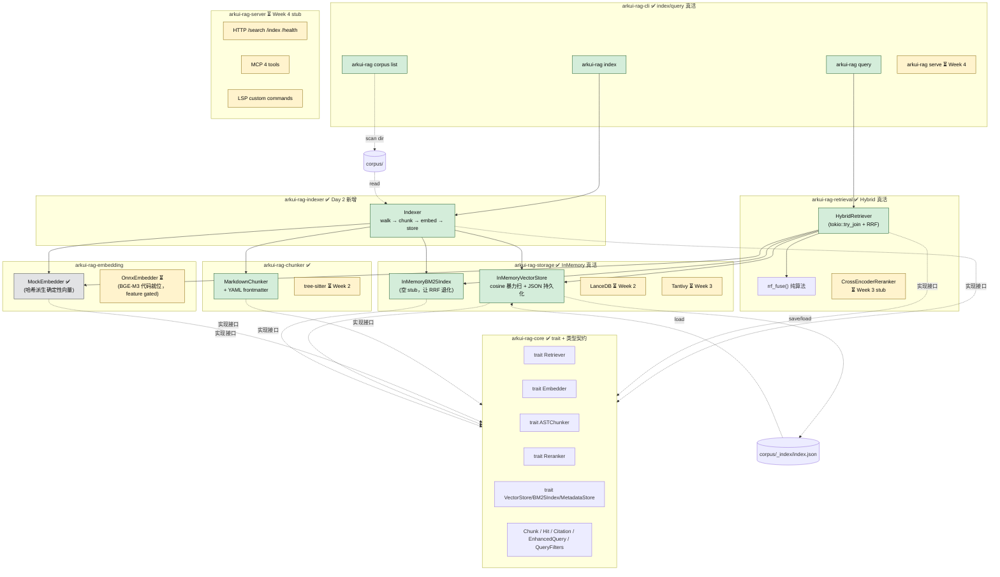
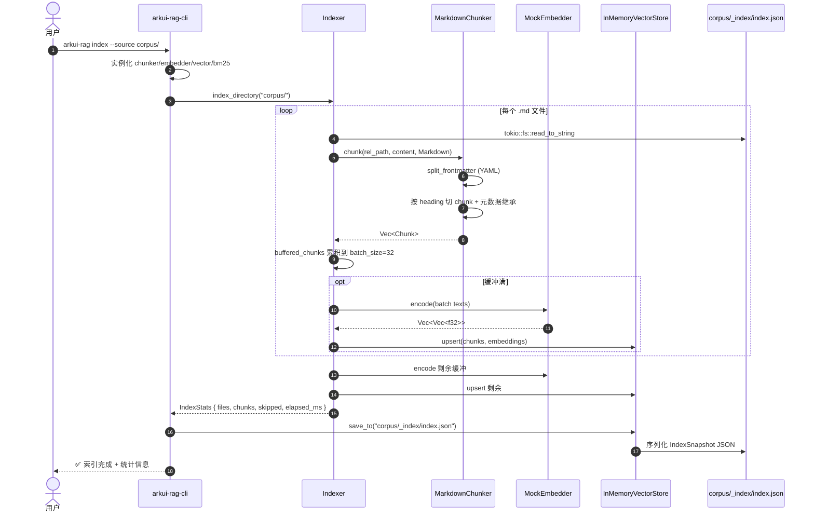
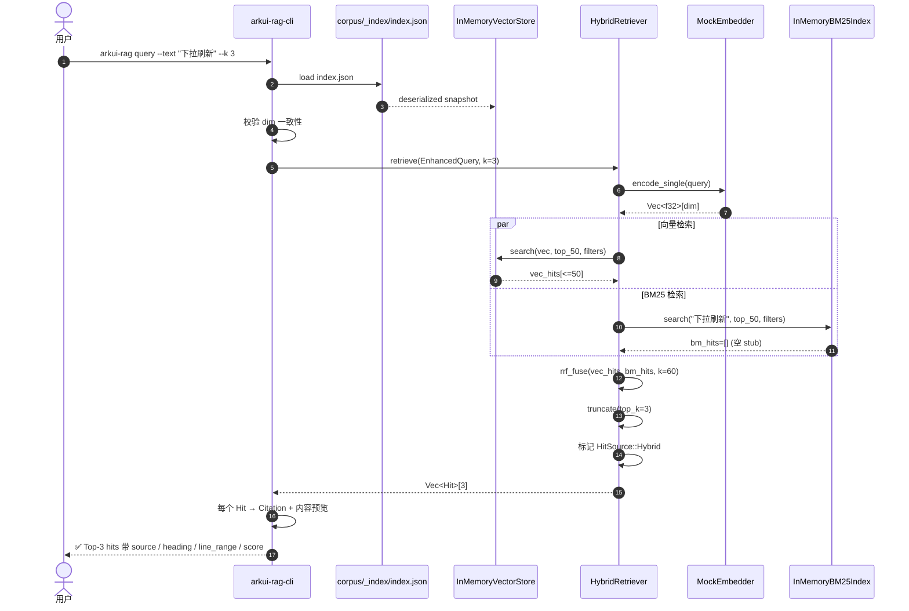

# 当前阶段快照（Day 2 · 端到端 Mock Demo）

> 生成日期：2026-05-27
> 对应 commit：`69216db feat: end-to-end Mock RAG demo (Day 2)`
> 上一份：无（首份阶段快照）
> 下一份：`STATUS-day3.md`（接 OnnxEmbedder 之后）

本文件回答四个问题：
1. 现在是什么状态（架构图 + 真活 / Mock / Stub 分布）
2. 输入是什么（corpus 格式 + CLI 参数）
3. 输出是什么（index.json schema + query 命中格式）
4. 怎么验证它工作（手动 + 自动）

---

## 一、当前架构图（Day 2 快照）

### 1.1 容器图（8 个 crate · 真活/Stub 状态）



**图例**：
- 🟢 alive：当前真活，能跑出真实结果
- 🟡 stub：接口就位、逻辑占位，未来 Week X 实装
- ⚪ mock：算法不真但确定性可测（MockEmbedder 哈希派生向量）

### 1.2 实际依赖图（Cargo 维度）

```
arkui-rag-cli
  ├── arkui-rag-indexer  ──┐
  ├── arkui-rag-retrieval ─┤
  ├── arkui-rag-chunker   ─┤
  ├── arkui-rag-embedding ─┼─→ arkui-rag-storage ──→ arkui-rag-core
  ├── arkui-rag-storage   ─┤        ↑
  └── arkui-rag-server    ─┘   (trait 集中地，所有 crate 都依赖它)
```

8 个 crate，零循环依赖；core 是叶子。

---

## 二、流程图（Day 2 端到端实际路径）

### 2.1 Index 流程（`arkui-rag index --source corpus/`）



### 2.2 Query 流程（`arkui-rag query --text "..." --k 3`）



---

## 三、输入契约

### 3.1 Corpus 文档输入

**位置**：`corpus/{official,samples,migration,errors,custom}/**/*.md`（Day 2 只识别 `.md` / `.markdown`，其他扩展名计入 `skipped`）

**单文件格式**（推荐带 YAML frontmatter）：

```markdown
---
api_name: "router.pushUrl"          # 可选
platforms: [HarmonyOS, Android]     # → ChunkMetadata.platforms
api_version: "ArkUI-X 1.2"          # → 用于过滤
deprecated: false                    # → 检索默认排除已弃用
type: "api_doc"                     # api_doc / code_example / migration_rule / error_fix
source_framework: null              # 仅 migration 用
complexity: "intermediate"
tags: ["routing"]
---

# Router

## pushUrl
推送新页面到路由栈。
```

**切分规则**：
- 顶部 `---\nYAML\n---\n` → frontmatter（应用到所有 chunk）
- 按 `#` / `##` / `###` heading 切（每个 heading 节是一个 chunk）
- `heading_path` 是 heading 栈链（如 `["Router", "pushUrl"]`）
- `line_range` 包含 frontmatter 偏移（相对原始文件）

**无 frontmatter 也能跑**，只是没元数据过滤能力。

### 3.2 CLI 输入

| 命令 | 参数 | 默认 |
|---|---|---|
| `arkui-rag index` | `--source <path>` `--index-path <file>` `--dim <n>` | `corpus` / `corpus/_index/index.json` / `384` |
| `arkui-rag query` | `--text "..."` `-k <n>` `--index-path <file>` | — / `5` / `corpus/_index/index.json` |
| `arkui-rag corpus list` | — | — |
| `arkui-rag --version` | — | — |
| `arkui-rag serve` | `--http` `--mcp` `--lsp` | （Week 4 实装） |

---

## 四、输出契约

### 4.1 IndexStats（`arkui-rag index` 完成后打印 + 函数返回）

```rust
pub struct IndexStats {
    pub files: usize,              // 成功索引的文件数
    pub chunks: usize,             // 产出的 chunk 总数
    pub skipped: usize,            // 跳过的文件（非 .md / 切分失败）
    pub elapsed_ms: u128,
    pub embedder_model_id: String, // 写入索引的 embedder 标识
}
```

控制台输出：
```
✅ 索引完成
   embedder    : mock-384
   files       : 12
   chunks      : 47
   skipped     : 3
   elapsed_ms  : 28
   saved to    : corpus/_index/index.json
```

### 4.2 索引产物 `corpus/_index/index.json`

```json
{
  "format_version": 1,
  "embedder_model_id": "mock-384",
  "embedder_dim": 384,
  "entries": [
    {
      "chunk": {
        "id": "router.md#Router/pushUrl@9",
        "content": "推送新页面到路由栈。\n",
        "metadata": {
          "source": "router.md",
          "heading_path": ["Router", "pushUrl"],
          "line_range": [9, 11],
          "platforms": ["harmonyos", "android"],
          "api_version": "ArkUI-X 1.2",
          "deprecated": false,
          "type": "api_doc",
          "tags": ["routing"],
          "extra": {"api_name": "router.pushUrl"}
        }
      },
      "embedding": [0.123, -0.456, ...]
    }
  ]
}
```

`format_version` 字段为升级（如切换到 LanceDB 或加压缩）留口子；加载时严格校验。

### 4.3 Query 输出（`arkui-rag query`）

```
✅ Top-3 hits (using mock-384)

─── [1] score=0.0163 ──────────────────
  source : router.md L9-11
  heading: Router > pushUrl
  preview: 推送新页面到路由栈。

─── [2] score=0.0156 ──────────────────
  source : router.md L13-14
  heading: Router > back
  preview: 返回上一页。

─── [3] score=0.0152 ──────────────────
  source : list.md L7-8
  heading: List > 下拉刷新
  preview: ArkUI-X 用 Refresh 组件实现下拉刷新。
```

`score` 是 RRF 分数（`Σ 1/(k+rank)`，k=60）；不是 cosine 相似度本身。

---

## 五、用户验证手段（手动）

### 5.1 装 rust + 全 workspace 编译

```bash
curl --proto '=https' --tlsv1.2 -sSf https://sh.rustup.rs | sh    # 一次性
make check                                                          # cargo check --workspace
```

期望：8 个 crate 全编译通过；首次 ~3 分钟（拉依赖）。

### 5.2 跑 23 个测试

```bash
make test
# 或
cd crates && cargo test --workspace
```

期望分布：
- `arkui-rag-chunker`：6 个（heading 切分、frontmatter、行号偏移、非法 YAML）
- `arkui-rag-embedding`：3 个（MockEmbedder 确定性、L2 归一、不同文本不同向量）
- `arkui-rag-storage`：5 个（upsert/search/dim mismatch/save-load roundtrip/bm25 空）
- `arkui-rag-retrieval`：6 个（vector 命中、空索引、top_k、platform filter、RRF）
- `arkui-rag-indexer`：3 个（含 2 个端到端集成测试）

### 5.3 端到端 demo

```bash
# 投放一个测试文档
cat > corpus/migration/list.md <<'EOF'
---
platforms: [HarmonyOS]
type: migration_rule
tags: [list, refresh]
---

# List

## 下拉刷新
ArkUI-X 用 Refresh 组件实现下拉刷新。
EOF

# 建索引 → 查询
cd crates
cargo run -p arkui-rag-cli -- index --source ../corpus
cargo run -p arkui-rag-cli -- query --text "ArkUI-X 用 Refresh 组件实现下拉刷新" --k 3
```

期望：Top-1 命中 `list.md > List > 下拉刷新`，score≈0.0167（≈ 1/(60+1)）。

**注意**：MockEmbedder 对**完全相同文本** cosine=1，对**不同文本**接近 0。所以 demo 查询语句必须是文档里某 chunk 的原文（或子串）才命中。这是 Day 2 的 mock 局限，**不是 bug**。Day 3 接 OnnxEmbedder 后才有真正语义相似能力。

### 5.4 看 corpus 状态

```bash
cd crates && cargo run -p arkui-rag-cli -- corpus list
```

输出 5 个子目录的文档数。

---

## 六、自动化验证手段（现状）

### 6.1 已有

| 手段 | 工具 | 覆盖范围 |
|---|---|---|
| **单元测试 × 20** | cargo test | 各 crate 内部逻辑（chunker/storage/retrieval/embedding） |
| **集成测试 × 3** | cargo test（indexer 的 unit + 2 个 e2e） | walkdir → chunk → embed → store → load → query 全链 |
| **类型系统** | rustc | 跨 crate trait 契约一致性 |
| **pre-commit hook** | `scripts/check-consistency.sh` 19 条规则 | 元数据 / 文档 / 归档一致性 |
| **classify-change.sh** | pre-commit hook | meta / business 分流 + 归档强制 |
| **scripts/commit.sh** | agent commit wrapper | 拦 `--no-verify` |
| **stats/tokens.jsonl** | post-commit hook | 每次 agent commit 自动追加改动统计 |

### 6.2 当前阶段没有但**建议加**（按 ROI 排序）

| 序号 | 项 | 工具 | 复杂度 | 何时加 |
|---|---|---|---|---|
| **A** | **GitHub Actions CI** | `.github/workflows/rust.yml` | 低 | 现阶段（30 分钟） |
| **B** | **demo smoke 脚本** | `scripts/demo-smoke.sh`（shell） | 低 | 现阶段（15 分钟） |
| **C** | **clippy + fmt 入 pre-commit** | Makefile 已有 target，hook 调用 | 低 | 现阶段（10 分钟） |
| D | 代码覆盖率 | `cargo-llvm-cov` | 中 | Day 3+ |
| E | 依赖审计 | `cargo-audit` | 低 | Day 3+ |
| F | 检索质量 recall@k | 自研评估脚本 + ground truth | 高 | **必须等 OnnxEmbedder 接好（Day 3）**，MockEmbedder 跑 recall 无意义 |
| G | 性能基准 | `criterion` | 中 | Week 3 后（有性能目标后） |
| H | RAGAS 接入 | Python 子流程 | 高 | Week 3 |

### 6.3 推荐 Day 2.5 自动化最小套件（A + B + C）

总耗时约 1 小时，覆盖：
- 编译回归（CI）
- 测试回归（CI）
- 风格门禁（fmt + clippy）
- demo 不被破坏（smoke 脚本）

---

## 七、阶段定位与下一切片建议

### 7.1 Day 2 完成度对照技术方案 6 周路线图

| 方案章节 | Day 2 状态 |
|---|---|
| Week 1：Rust 项目骨架 + tree-sitter 切 ArkTS / Kotlin | 骨架 ✅；tree-sitter ⏳；MarkdownChunker ✅ |
| Week 1：LanceDB + tantivy 接入 | ❌（InMemoryVectorStore 占位） |
| Week 1：BGE-M3 ONNX 推理打通 | 代码就位 + feature gated ⏳ |
| Week 2：混合检索 + RRF | ✅ |
| Week 2：Reranker 接入 | ⏳ stub |
| Week 2：HyDE 改写 | ❌ |
| Week 2：基础评估集 | ❌ |
| Week 3：HTTP API + MCP + CLI | CLI ✅；HTTP/MCP ⏳ |
| Week 4-6 | ❌ |

**估算**：当前进度约相当于技术方案 Week 1 后半 + Week 2 前半。

### 7.2 关于是否导入 ArkUI-X 文档（问题 1 详答）

| 选项 | 现在做的价值 | 风险 |
|---|---|---|
| **不导入**（推荐） | 等 Day 3 OnnxEmbedder 后导入，能真正验证语义检索质量 | 当前 demo 略空 |
| 少量导入（2-3 份） | 验证 indexer 在真实文档（HTML 嵌入、中英混合、缺字段）的容错 | 几乎无 |
| 大批量导入 | 压测 indexer 性能；让 demo 看起来真实 | git 体积变大；MockEmbedder 阶段检索质量验证无意义 |

**Agent 建议**：选"少量导入（2-3 份）"作为契约容错测试。完整导入留到 Day 3。

### 7.3 关于自动化验证手段（问题 3 详答）

见 §6.2 表 → **A + B + C 是 Day 2.5 建议**。其中：
- **A（CI）** 是最关键的：现在没有 CI 意味着每次提交都靠 agent 手动验证，等团队扩大就崩
- **B（smoke 脚本）** 让"端到端可跑"成为 hook 可校验项
- **C（clippy + fmt）** 防止代码风格漂移

---

## 八、本文档维护约定

- 每完成一个"Day"切片产出新的 `STATUS-day<N>.md`（如 `STATUS-day3.md`）
- 旧 STATUS 不删（历史归档，便于回溯演进）
- 每份 STATUS 必含：架构图 + 输入契约 + 输出契约 + 用户验证 + 自动化验证 + 下一切片建议
- 关键架构决策仍以 `docs/ADR-XXX.md` 为单一事实源；STATUS 只引用不复制
