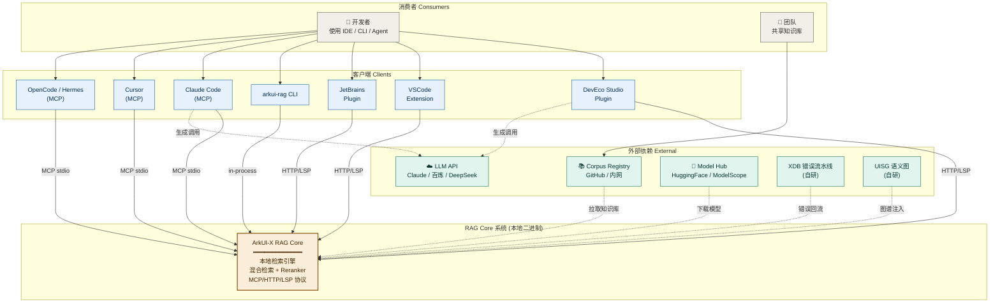
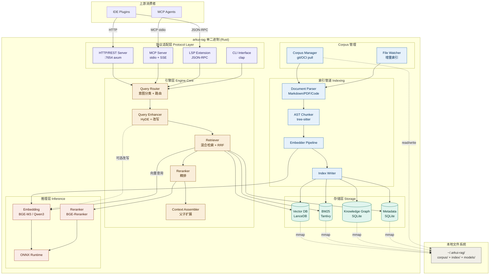
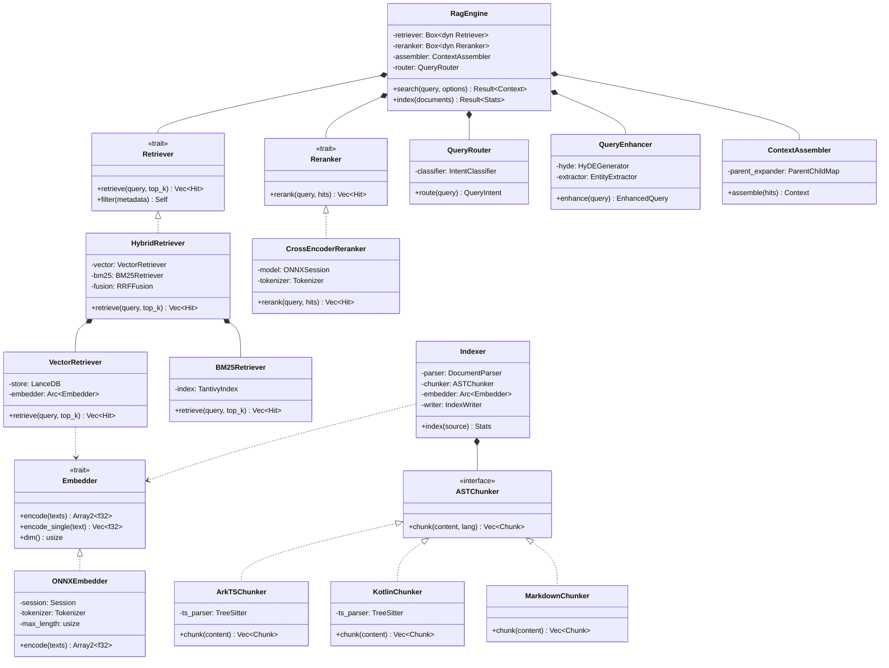
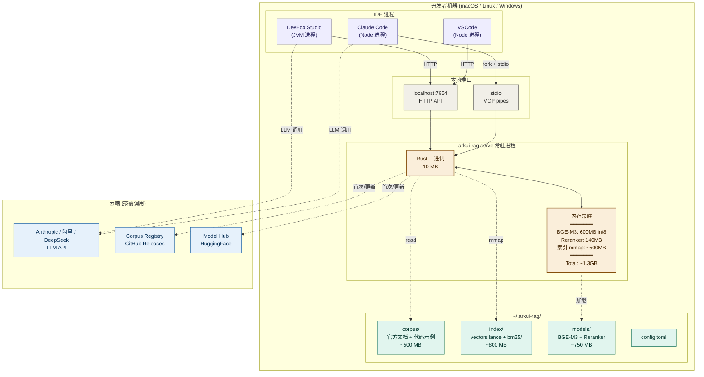
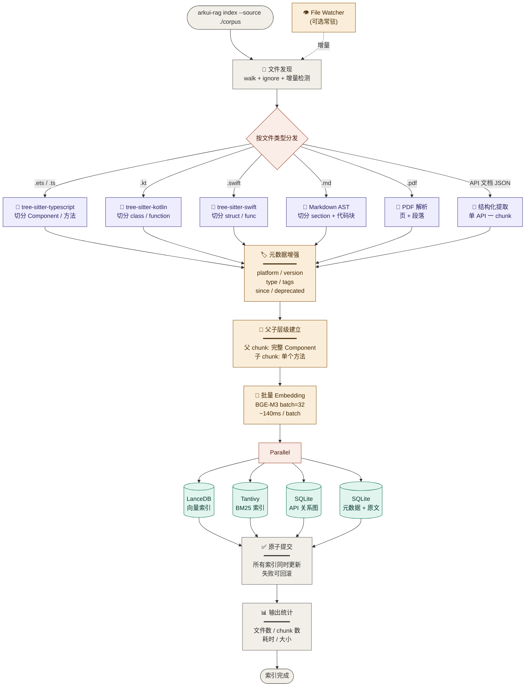
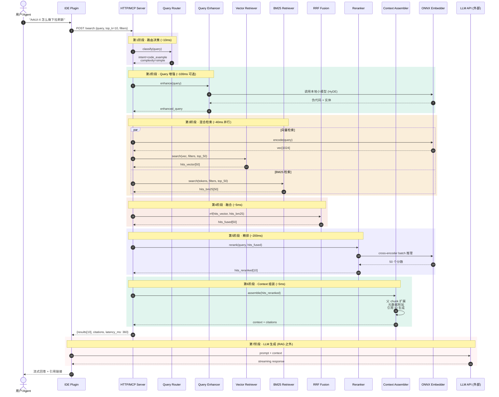
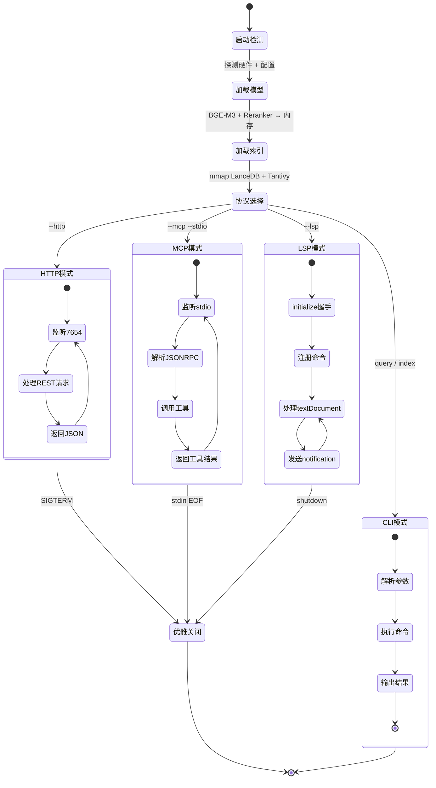
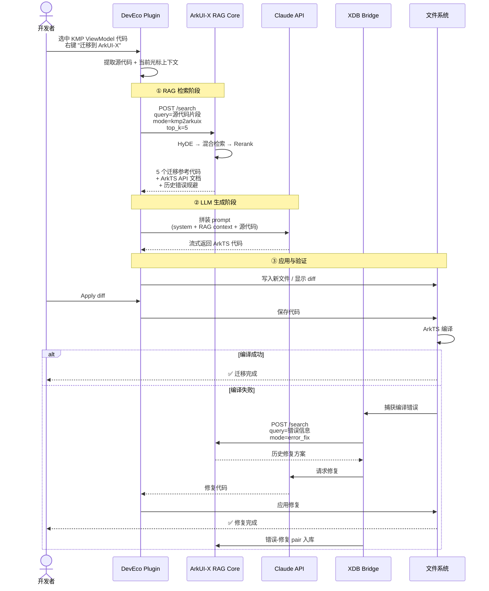

# ArkUI-X RAG 系统 UML 架构图集

> 七张图覆盖：系统上下文 → 容器架构 → 组件设计 → 部署拓扑 → 索引流程 → 检索流程 → 错误飞轮

---

## 图 1：系统上下文图（C4-Level 1）

**视角**：RAG 系统在整个生态中的位置 —— 谁用它、它依赖什么。



**关键洞察**：
- RAG Core 是中心节点，但**只做检索**，不做生成
- LLM 调用由各 Client 各自完成（关注点分离）
- XDB/UISG 是你们独有的飞轮输入

---

## 图 2：容器架构图（C4-Level 2）

**视角**：RAG Core 内部分成哪几个进程/服务/库。



**关键设计**：
- 协议层、引擎层、推理层、存储层**完全解耦**
- 同一个二进制可启动为 HTTP / MCP / LSP / CLI 任一形态
- 文件系统是唯一持久化（无 Docker 无数据库）

---

## 图 3：核心组件类图（C4-Level 3）

**视角**：Rust trait/struct 设计，关键扩展点。



**关键设计哲学**：
- Retriever/Reranker/Embedder 全部是 **trait**，可热插拔
- 多语言切分器走策略模式（ArkTS / Kotlin / Swift / Markdown）
- Embedder 被 VectorRetriever 和 Indexer 共享（同一个模型实例）

---

## 图 4：部署拓扑图

**视角**：用户机器上 RAG 系统的物理布局。



**关键事实**：
- 总内存占用 ~1.3GB（含模型）
- 总磁盘占用 ~2GB（首次安装后）
- LLM 调用由 IDE/Agent 各自管理，不经过 RAG 进程
- 离线可用（首次安装后不依赖网络）

---

## 图 5：索引流程图（Indexing Pipeline）

**视角**：文档怎么从原始格式变成可检索的索引。



**关键步骤**：
1. AST 切分 → 保留语义边界（绝不固定字符数切）
2. 元数据增强 → 后续可精准过滤
3. 父子层级 → 检索小、返回大
4. 并行写入 → 四个索引同时落盘
5. 原子提交 → 失败可回滚

---

## 图 6：检索流程时序图（Retrieval Sequence）

**视角**：一次完整检索调用，各组件如何协作。



**关键时序约束**：
- RAG Core 端到端：~360ms（含可选 HyDE）
- 不含 HyDE：~260ms
- 第 3 阶段必须并行（向量 + BM25）
- 第 5 阶段是精度关键，但延迟主导

---

## 图 7：错误飞轮闭环（XDB 集成）

**视角**：你们最大差异化护城河 —— 错误自动回流的工程闭环。

```mermaid
flowchart LR
    subgraph dev["开发态"]
        DEV["👤 开发者写代码"]
        IDE["IDE Plugin"]
    end

    subgraph rag_loop["RAG 检索 + 生成"]
        Q["用户 Query"]
        RAG["RAG Core 检索"]
        GEN["LLM 生成代码"]
    end

    subgraph build["构建/运行"]
        COMPILE["ArkTS 编译"]
        RUN["运行/调试"]
        XTS["XTS 自验证<br/>AutoUI 验证"]
    end

    subgraph xdb_layer["XDB 错误捕获"]
        XDB_C["XDB Bridge<br/>编译错误捕获"]
        XDB_R["XDB Bridge<br/>运行时错误捕获"]
        XDB_U["UISG 一多合规<br/>检测"]
    end

    subgraph fix_loop["修复闭环"]
        SUG["LLM 生成修复方案"]
        APPLY["应用修复"]
        VERIFY["二次验证"]
    end

    subgraph corpus_grow["语料飞轮"]
        REVIEW["人工/自动审核"]
        PAIR["错误-修复 Pair<br/>结构化"]
        INDEX_INC["增量索引"]
        ERR_CORPUS[("📚 corpus/errors/<br/>独有错误知识库")]
    end

    DEV --> IDE --> Q --> RAG --> GEN --> COMPILE
    COMPILE -->|✅ 成功| RUN --> XTS
    COMPILE -->|❌ 失败| XDB_C
    RUN -->|❌ 崩溃| XDB_R
    XTS -->|❌ 不合规| XDB_U

    XDB_C & XDB_R & XDB_U --> SUG
    SUG --> APPLY --> VERIFY
    VERIFY -->|✅ 修复成功| REVIEW
    VERIFY -->|❌ 仍失败| SUG

    REVIEW --> PAIR --> INDEX_INC --> ERR_CORPUS
    ERR_CORPUS -.->|检索时召回<br/>避免重蹈覆辙| RAG

    classDef devBox fill:#E6F1FB,stroke:#185FA5,color:#042C53
    classDef ragBox fill:#FAEEDA,stroke:#854F0B,stroke-width:2px,color:#412402
    classDef buildBox fill:#EEEDFE,stroke:#3C3489,color:#26215C
    classDef errBox fill:#FCEBEB,stroke:#A32D2D,color:#501313
    classDef fixBox fill:#E1F5EE,stroke:#0F6E56,color:#04342C
    classDef growBox fill:#FAECE7,stroke:#993C1D,stroke-width:2px,color:#4A1B0C

    class DEV,IDE devBox
    class Q,RAG,GEN ragBox
    class COMPILE,RUN,XTS buildBox
    class XDB_C,XDB_R,XDB_U errBox
    class SUG,APPLY,VERIFY fixBox
    class REVIEW,PAIR,INDEX_INC,ERR_CORPUS growBox
```



**飞轮逻辑**：
1. 每次错误被 XDB 捕获 → 自动进入修复循环
2. 修复成功的 case → 结构化为 错误↔修复 pair
3. 增量索引到 corpus/errors/ → 下次类似错误检索时直接命中
4. **越用越聪明**，竞争对手永远没有你们的真实错误数据

---

## 图 8：协议适配状态图（MCP/HTTP/LSP 三模式）

**视角**：同一个二进制如何切换形态服务不同消费者。



**核心价值**：
- 同一份代码、同一份模型、同一份索引
- 4 种协议无缝切换
- 部署时只需选择一个 flag

---

## 附：完整端到端代码生成时序（业务视角）

**视角**：用户视角看一次"迁移 KMP 代码到 ArkUI-X"的完整链路。



---

## 架构图阅读顺序建议

```
理解全局 → 图 1 (上下文)
深入内部 → 图 2 (容器)
代码层面 → 图 3 (类图)
物理部署 → 图 4 (部署)
索引流程 → 图 5 (索引)
检索流程 → 图 6 (时序)
独家壁垒 → 图 7 (飞轮)
协议形态 → 图 8 (状态)
业务闭环 → 附图   (端到端)
```

九张图构成完整的 RAG 系统蓝图，从产品视角到代码细节全部覆盖。
